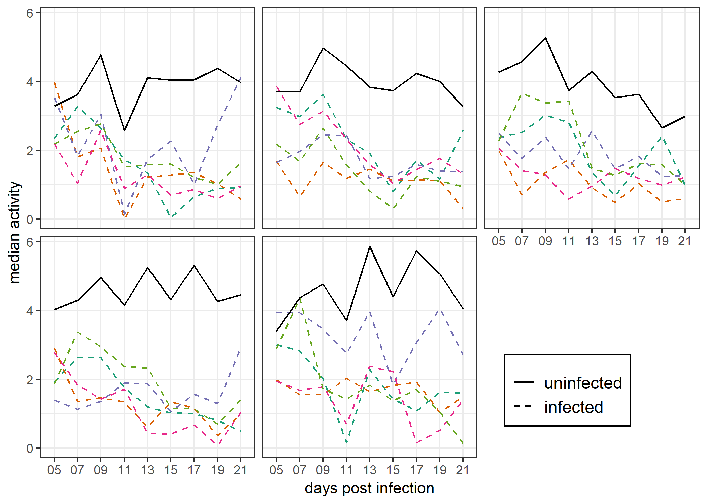
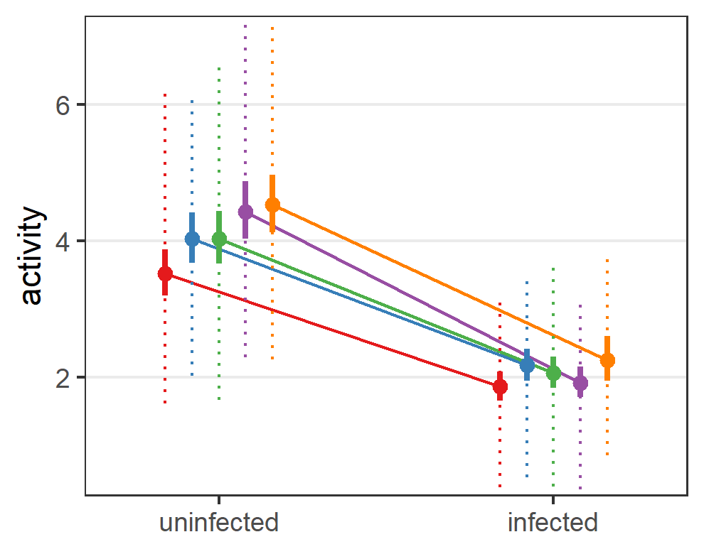
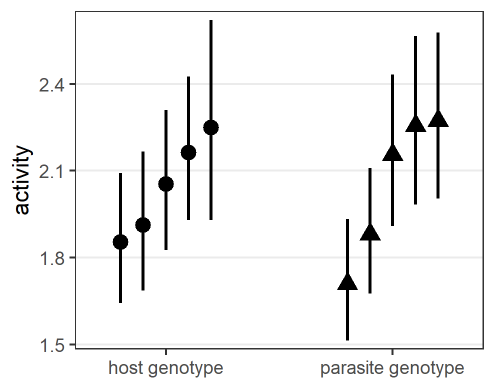

This repository contains the data and analyses of an experiment that disentangled the effect of host and parasite genetics on the modified behavior of the host. I have divided the analyses into several steps. First, in this [notebook](analyses/GxG_01_define_responses.md) I define the response variables for the analysis, looking for a reasonable balance between simplicity and information. Second, in this [notebook](analyses/GxG_02_genotype_comps.md) I perform exploratory analyses exploring the roles of host vs parasite genotype. Third, in this [notebook](analyses/GxG_03_ms_anlayses.Rmd) I fit complex mixel models to the data to test specific hypotheses. Fourth, I made manuscript quality figures in this [notebook](analyses/GxG_04_pub_figs.md).

# Experiment background

Many parasites manipulate the behavior of their hosts in ways that seem beneficial. Little is known about genetic variation in manipulated phenotypes. Are parasites genetically variable in how much they manipulate host behavior? Do some host genotypes resist manipulation better than others? I infected 5 host strains with 5 parasite strains to quantify the variability in host manipulation due to parasite genes, host genes, and their interactions. The host-parasite system I used was the tapeworm *Schistocephalus solidus* in its copepod first intermediate host.

I recorded copepod behavior every other day throughout the parasite's development from uninfective to infective larva (from 5 to 21 days post infection). An [automated tracker](https://github.com/dbenesh82/automatic_copepod_tracker) was developed to record copepod movement.

For each recording event, copepods were recorded for two minutes. After one minute, the well plate containing the copepods was dropped in a standardized way to simulate a predator attack and 'frighten' the copepods. 

I explored different behavioral variables that could be extracted from these recordings [here](analyses/GxG_01_define_responses.md). I decided to focus on 'activity', which was the average speed copepods moved before and after the drop (it could be equivalently expressed as the distance moved). Activity incorporates both the frequency and magnitude of copepod movements. And though I found that the difference between infected and uninfected copepods was mainly determined by [movement frequency](analyses/GxG_01_define_responses.md#proportion-of-time-moving-vs-hop-distance), I decided there was little to gain by breaking this variable down into its component parts.

Most analyses involved these datasets: [infection data](data/GxG_inf.csv) and [behavior data](data/behav_autotracked_reduced_dataset.csv) from the auto-tracker.

# Main results

I found that copepod activity was modified by infection - infected copepods were less active than uninfected copepods. Moreover, copepod activity, was affected by both host and parasite genotype, but there was not clear evidence for host-parasite genotype interactions. Three observations indicated that host behavior was chiefly determined by parasite genes.

**(1)** No combinations of host and parasite genotype were unmanipulated.

**(2)** Parasitism reduced the variation observed among copepod genotypes.

**(3)** Within infected copepods, parasite genotype had twice as large an effect on behavior as host genotype.

I conclude that the altered behavior of infected copepods primarily represents the action of parasite genes and is an extended parasite phenotype.

# Reference

These analyses have been published:
[Benesh, D.P. 2019. Tapeworm manipulation of copepod behaviour: parasite genotype has a larger effect than host genotype. Biology Letters 15. doi: 10.1098/rsbl.2019.0495](https://royalsocietypublishing.org/doi/10.1098/rsbl.2019.0495).