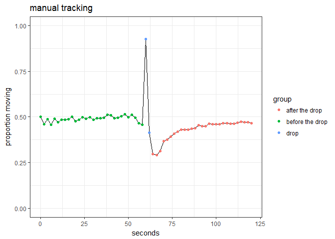

Genotype x genotype interactions in host manipulation
================
Dan Benesh

Experiment Background
=====================

Many parasites manipulate the behavior of their hosts in ways that seem beneficial. Little is known about genetic variation in manipulation. Are parasites genetically variable in how much they manipulate host behavior? Do different host genotypes resist manipulation better than others? I infected 5 host strains with 5 parasite strains (25 combinations) to quantify the variability in host manipulation due to parasite genes, host genes, and their interactions. The host-parasite system I used was the tapeworm *Schistocephalus solidus* in its copepod first intermediate host.

Copepod movement was video recorded for two minutes. After one minute, the well plate containing the copepods was dropped in a standardized way to simulate a predator attack and 'frighten' the copepods. Each copepod was recorded on several days throughout the course of parasite development (from uninfective to infective larva).

Recordings were processed both manually (clicking on copepod position frame-by-frame) and automatically (with a tracking program). The output from the two approaches was quite similar (see an extensive comparison [here](https://github.com/dbenesh82/automatic_copepod_tracker/blob/master/compare_manual_vs_auto_tracking/testing_automatic_tracker.md)). Each approach has some advantages and disadvantages. First of all, I identified mistakes in the manually-processed data, like incorrect number of frames, etc. (see [here](https://github.com/dbenesh82/behav_vid_data_compiler)); this human error motivated the development of an auto-tracker. The auto-tracker allowed additional videos and copepods to be processed that were not included in the manual data for lack of time. However, the auto-tracker was also not free from mistakes, occassionally incorrectly recording large movements.

In this notebook, I first present descriptive statistics from the experiment. Then, I look at ways of quantifying behavior and defining the response variable. Next, I look at ways to justifiably simplify the data for the main analyses. The main analysis, looking for genotype by genotype interactions, is conducted in a separate [notebook](GxG_01_define_responses.Rmd).

Descriptive Statistics
======================

Let's look at some basic stats. How many copepods were in the experiment?

    ## [1] 1678

How many were exposed to infection?

    ## [1] 1540

The rest were unexposed controls (n = 138).

Whether copepods were infected or not was checked one week after exposure. How many survived until being checked for infection?

    ## [1] 1639

And how many were infected?

    ## [1] 418

So the infection rate was 27.1%.

We can also do some quality control checks on our infection data. For example, I measured some parasite traits like cercomere presence (an indication of developmental rate) and worm size. We can check to make sure these variables are only recorded from infected copepods, starting with cercomere presence.

It is, though 5 infected copepods are missing cercomere data.

    ##        
    ##              infected unexposed uninfected
    ##   FALSE  136        5       138       1084
    ##   TRUE     0      413         0          0

Similarly, worm size was only recorded from infected copepods, though in 99 it was not measured. Most of those without size measurement died before the end of the experiment 21 days post exposure.

    ##        
    ##              infected unexposed uninfected
    ##   FALSE  136       99       138       1084
    ##   TRUE     0      319         0          0

Worm size was measured twice. The two measures are highly correlated, with a pearson correlation coefficient of 0.81, though there was some variation in the measurements.

Presumably, this is normal measurement error due to e.g. photo angles, moving worms, etc. The average of the two body size measurements is taken as the best measure of larval size in future analyses.

Moving on to the behavior data, how many copepods had their behavior recorded manually?

    ## [1] 686

How many were recorded automatically?

    ## [1] 1018

There are 5 cop families and 5 parasite families. How many infected cops are in each group?

    ##        parasite_fam
    ## cop_fam  Q  U  V  W  Z
    ##     I   18 21 12 25 16
    ##     II  14 17 21 18 17
    ##     III 20 14 15 15 18
    ##     IV  14 20 15 25 22
    ##     V    8 12 14  8 10

It ranges from 8 to 25 per combination, with an average of 16.4. This is the same for both auto- and manually-tracked behavior data, as all infecteds were tracked, but more uninfecteds were processed with the auto-tracker.

What about the uninfected copepods? Let's check the numbers of unexposed controls and exposed-but-uninfected copepods in each copepod family. Generally about 30 per family in the manually-tracked data.

    ##        trt
    ## cop_fam unexposed uninfected
    ##     I          28         30
    ##     II         20         30
    ##     III        30         30
    ##     IV         32         30
    ##     V          17         30

In the auto-tracked data, additional exposed-but-uninfected copepods were tracked with the auto-tracker. This was done to establish a better baseline for the behavior of uninfected copepods in each family.

    ##        trt
    ## cop_fam unexposed uninfected
    ##     I          28         92
    ##     II         20        100
    ##     III        30         91
    ##     IV         32         92
    ##     V          17        103

Each copepod was observed on multiple days over the course of the experiment. In the manual dataset, how many times were copepods observed on average?

    ##   infected  unexposed uninfected 
    ##       6.66       6.57       6.69

In each treatment group, there were nearly 7 observations per copepod, corresponding to days 5, 7, 9, 11, 13, 15, and 17 post-infection. Sometimes, copepods died before the end of the experiment, which is why there were fewer than 7 observations for some individuals. What about the auto-tracking data?

    ##   infected  unexposed uninfected 
    ##       8.27       8.13       8.05

The average number of recordings per copepod increased to over 8. This is because I used the auto-tracker to process additional videos taken at days 19 and 21 postinfection that were not previously manually-processed.

Define Response Variables
=========================

What measures of copepod behavior should we extract from the videos? What should be our response variable? Can we simplify the very fine frame-by-frame data to something more manageable and understandable? First, I examine the utility of different measures of copepod behavior. Second, I check ways to simplify the measurements to ease modelling and improve understanding.

Behavioral variables
--------------------

### Speed

The simplest measurement is the distance a copepod moved between frames. We can also call this copepod's speed, given that it is a distance moved in a defined time. Behavior was filmed over two minutes, with the plate being dropped in the middle of the recording. So *a priori* we can divide a recording into three sections: before the drop, during the drop, and after the drop. Let's see how average speed changes throughout a recording.

 

The most conspicuous pattern is the spike at 60 second during the drop. In fact, the copepod moves so fast during this drop that it cannot be reliably tracked, even at the high frame rate of an 8/second. The slight change in plate position through the drop also causes problems with background subtraction in the auto-tracking program. The values during the plate drop cannot be considered accurate and need to be removed before analyses. But how much should we remove on either side of the drop?

Let's zoom in on the drop. Just eyeballing it, it seems like taking the 1.5 seconds on either side of the drop seems to reasonably exclude most of the peak.

When we exclude the data around the drop, we see more clearly how copepods respond.

 

There is a clear decrease in activity directly after the drop, but the copepods seem to recover rather quickly so that by the end of the recording their activity levels have recovered. Also, in the auto-tracked data, there is still a spike shortly before the drop, which was not observed in the manual data. I think this represents a problem with how background subtraction works at the 'edges' of the video (i.e. before and after the drop). Presumably, this is random error and it shouldn't bias treatment differences, but it might be worth excluding a little more than 1.5 seconds on both sides of the drop.

### Proportion of time moving vs hop distance

Instead of asking how far/fast a copepod moved in a given time frame, we can ask if it was moving at all. This may provide some additional nuance, because a copepod can move the same distance over a recodring in different ways, e.g. steady, slow movements vs. a few large, fast movements. Previous studies (e.g. [this one](https://www.cambridge.org/core/journals/parasitology-open/article/does-resource-availability-affect-host-manipulation-an-experimental-test-with-schistocephalus-solidus/9B4BB3EF39398EFB4F93C8A4DE403C6A)) using the same recording approach have examined two behavior variables: i) whether a copepod was moving and ii) if yes, how fast/far it was moving. These two behavioral variables are components of the 'speed' measure used above, but now let's separate them to see if it adds any information. In particular, we are interested in how they are affected by infection.

We can plot how both variables from both datasets vary over the recording period, starting with whether copepods were moving or not.

 

As expected, the patterns are very similar to those observed for 'speed' above. The auto tracker seems to miss some movements at the start of the recording, which probably has to do with how quickly the video's 'background' is established and then subtracted out by the movement detection algorithm. It also detects less movement overall, due to the higher frame rate - more movement can happen in 2 seconds (manual frame rate) than in an 1/8 of a second (auto frame rate).

Now we plot the second variable: how far a copepod moves, given that it is moving. I'll call this hop distance, as this implies movement.  

Here there is a conspicuous difference between auto and manually tracked data. Right after the drop, copepods seems to exhibit large movements in the auto dataset, which is tempting to interpet as escape movements, but the opposite is seen in the manual tracking data. There copepods exhibit smaller hops after the drop. So, again it looks like there some auto-tracking artifacts, probably due to the background being shifted when a plate is dropped. However, looking beyond the time period shortly after the drop, we see the hop distances are rather comparable before and after the plate drop. So, copepods do not substantially alter hop magnitude in response to the drop.

Time moving and hop distance exhibit different patterns over the recording, suggesting they are not correlated and thus provide some independent information on copepod behavior. We can average these two variables over each recording and check their correlation.

There are very high hop distance values in copepods that hardly moved. This is because, when few movements are detected, a single large, perhaps-erroneously-recorded movement determines the average hop distance. When we zoom in to exclude the copepods with a few, high magnitude movements, then we see that there is not a strong correlation between these variables. The residual variation suggests that copepods tend to move more slow-and-steady in some recordings and more fast-and-jerky in others.

In this experiment, we want to know how infection affects where copepods land on this plot, i.e. do infecteds differ in both variables, just one, or none?. Additionally, we would like to know if there is a clear response to the plate drop in one or both of these variables. Let's add median values for the infection groups to the above plot and split it by the recording period, before and after the drop.

 

Again, there are idiosyncratic differences between the datasets (like the aforementioned spurious combinations of large hops with little movement in the auto-tracking dataset). Nevertheless, the qualitative patterns appear similar in both datasets. The infecteds clearly spend less time moving than uninfecteds (shifted on the x-axis), but their hops are comparable (minimal shift along the y-axis). Additionally, response to the drop are subtle, suggesting copepods do not massively alter their behavior in response to the 'shock'. Indeed, the time-series plots [above](LINK!!) suggest that on average they recover to pre-drop levels within a minute.

Here's another way to visualize treatment and drop effects in the two behavior variables. Until now, we have looked at averages across recordings and groups, ignoring how individual copepods respond to the drop within a recording. The next plots show how individuals respond to the drop, first for proportion of time moving. The overall averages are plotted in bold.

 

The qualitative pattern is very similar in the two datasets - infecteds spend less time moving in general and all groups reduce activity after the drop. The values are higher in the manual data, but this makes sense given it's lower frame rate, i.e. more movement is possible in 2 seconds than in 1/8 of a second. Also, there is substantial individual variation, sometimes copepods move substantially more after the drop.

Making the same plot for our second response variable, hop distance...

 

Here the pattern is a little differnt. In neither dataset is there much response to the drop - copepod hops are of a similar magnitude before and after being frightened. Thus, the main response to the drop is fewer movements, not a change in the type of movements. In the manual dataset, the infecteds seem to have slightly smaller hops than uninifecteds, but this is not seen in the auto-tracked dataset.

We can also make these plots for average speed, the composite of time moving and hop distance.

 

The pattern is quite similar in both datasets. Average speed decreases in response to the drop, particularly in the uninfected groups because they were more active to begin with. Infected copepods are less active regardless of whether they are observed before or after the drop.

To summarize, Infected copepods spend less time moving than uninfected copepods, but when they are moving, their 'hops' are of a similar magnitude. In response to the drop, copepods also reduce how often they move, but not how fast they move, i.e. their 'hops' are similar. Given these results, my preference is to *not* break movement in multiple variables in further analyses. First and foremost, this is simpler. Hop distance seems relatively unaffected by infection or the drop, so it is not obvious this variable reflects anything of biological importance. Additionally, analyzing multiple variables increases the opportunity for false positives (p-hacking), which is relevant when we get to the main analysis comparing host and parasite genotypes (25 combinations!). Alternatively, I could just use time moving as the response, because infection and drop effects are mainly in this variable. However, this would exclude all information on copepod speed/distance, which to me would be an excessively aggressive data-pruning strategy. The composite measure can be conveniently called 'activity' and expressed as either a distance or a speed.

One issue to address later at the modelling phase is the unusual distribution of activity. Here it is at the frame level...

...and at the composite level of average activity across a recording.

In both cases, it is skewed, though less so when averaged, and with an excessive of low/zero values. We'll return to this issue when we start building statistical models, but now let's look at one more potential response variable that can be extracted from the tracking data.

### Angle of movements

Another aspect of behavior that can be extracted from the recordings is the direction moved by copepods, like whether they moved forwards or backwards. I calculated the angle of movement between consecutive video frames.

Here is the distribution of movement angles in both datasets.

 

The distributions clearly differ; there are far more backwards movements in the auto data (angle values near 180). This is partly due to the different time scales of the datasets. The auto-tracking data recorded copepod position 8 times per second, and consequently there was a lot of opportunity for slight oscillations of the tracker back and forth (i.e. high angles). By contrast, copepod position was recorded once every two seconds in the manual dataset, so there should be less 'noise' oscillations.

We can understand the difference between the datasets by plotting angle vs the distance moved.

Forward movements (low angles) tend to be larger in both datasets. But in the auto-tracked dataset, there is an overabundance of backward movements, most of which are small, though some are large. Large backwards movements are tracking mistakes - the auto-tracker incorrectly jumps to one part of the well and then back again. I took steps to correct these mistakes (see [here](https://github.com/dbenesh82/automatic_copepod_tracker/blob/master/compare_manual_vs_auto_tracking/fix_auto_track_mistakes.R)), but was perhaps too conservative in eliminating these kinds of movements.

In neither dataset is there evidence that the drop markedly changed the directions moved. Copepods do not more often move backwards or in a zig-zag pattern for instance. We can also visualize this by plotting average movement direction over the recording.

 

The drop induces changes in opposite directions in the two datasets. The auto-tracker 'resets' at the drop (i.e. background subtraction of the video frames starts over), so it may not spot the copepod immediately. Once it is tracking something, the small back-and-forth oscillations then dominate and determine the high mean values. In the manual dataset, the average tended to be lower, around 45 degrees, which corresponds closely to typical copepod movements along the edge of the circular wells. Also, the increase in angle values right after the drop in the manual data could indicate more sideways or backwards movement by copepods, but this should not be over-interpreted because this was also where copepods moved the least. One consistent feature of both datasets: angle values return to 'pre-drop' levels very quickly, suggesting the kinds of movements made by copepods were not fundamentally altered by this shock.

Given that (i) the auto-tracker seems to introduce a lot of noise into this variable measure and (ii) there is not an obvious response to the drop, this variable does not seem very interesting. But before ignoring it, I want to check whether movement angles differ between infected and uninfected copepods.

There is no conspicuous difference between treatments in either dataset, regardless of whether movements are large or small or whether they were before or after the drop. A similar way to assess this by calculating dot products for movements. The dot product of two vectors combines information about vector magnitudes and directions into a single value. [Elsewhere](https://github.com/dbenesh82/automatic_copepod_tracker/blob/master/compare_manual_vs_auto_tracking/testing_automatic_tracker.md#treatment-comparisons) I compared dot products among treatments and found that they do not differ. Thus, there seems to be little to gain by looking at the *direction* copepods move - it does not respond to the drop nor does it differ between treatments.

To this point, we have considered different ways of recording copepod behavior and have found that 'activity', a combination of movement frequency and magnitude, is a simple measure that captures the behavior of biological interest. Next, I consider ways to further simplify this variable for downstream analyses.

Simplifying behavioral measurements
-----------------------------------

### Reducing the frame rate

Previous [studies](https://www.cambridge.org/core/journals/parasitology-open/article/does-resource-availability-affect-host-manipulation-an-experimental-test-with-schistocephalus-solidus/9B4BB3EF39398EFB4F93C8A4DE403C6A) recorded copepods at 1 frame per 2 sec, which preliminary experiments determined was optimal for manual tracking, as only a small number of frames needed to be clicked through and it did not miss much movement. By comparison, the auto tracker used 8 frames/sec, a frame rate 16 times higher. This high rate was used because each frame helped establish the recording's 'background', which was then subtracted out to detect movement from one frame to the next. Recording a copepod's position every 1/8 of a second is presumably overkill; it probably detects superfluous movements and creates an unnecessarily large dataset. But how much should we reduce the frame rate? To evaluate this, I averaged copepod position across frames for several frame rates and then recalculated the distance moved between frames. To compare different frame rates, I summed the total distance moved during the recording - if much information is lost with lower frame rates, then the correlation between the full and the reduced-rate datasets should decrease.

As expected, the correlation (r2 on the y-axis below) between the full dataset and the reduced datasets decreases as the frame rate is reduced. However, even when the frame rate is reduced 8-fold to 1 per sec, r2 is still quite high (0.9), indicating that we are not losing much information on copepod movement. And some of the lost information might be random noise, i.e. the tiny oscillations between frames that are averaged out at lower frame rates.

Subjectively, a frame rate of 2 per second seems like a reasonable compromise. It reduces the auto-tracked data 4-fold, while retaining much of the information (r2 = 0.93). Conversely, compared to the manually-tracked data, this retains 4x more data on copepod position, though as mentioned before, previous work did not indicate a lot of information gain through a frame rate higher than 1 per 2 seconds. In the end, the reduction in frame rate is a practical decision, unlikely to bias or gloss over differences between treatments.

In fact, when we plot the differences between treatments, the pattern is unchanged.

The reduction in frame rate also makes the data more similar to the manual dataset. Using the total distance moved over a recording, the correlation between the full auto-tracked data and the manual data was 0.89. The correlation between the 4-fold reduced frame rate data and the manual dataset is larger at 0.93, as we would expect.

In sum, I believe the reduced frame-rate dataset has several advantages. One, it reduces the full dataset significantly (4x), easing statistical modelling. Two, it is more similar to the manual dataset, yet it still retains additional movement information (though I don't know if this extra info represents improved tracking or just random noise). Three, it retains additional recordings that were not in the manual dataset (manual processing was tedious and slow, so it was not done for all recordings). Finally, using auto-tracked data circumvents some of the flaws in the manual dataset I previously discovered (see [here](https://github.com/dbenesh82/behav_vid_data_compiler/blob/master/wrangling_data/quality_control_notebooks/quality_control_behav_data1.ipynb)).

### Categorizing sections of the recording

Even with a reduced frame rate, there is still substantial pseudoreplication in the data; within a recording, observations are separated by half a second and are conceivably highly correlated. In [previous analyses](LINK!!), we fit mixed models to account for this (i.e. treat recording as a random effect). However, this might be insufficient, because it assumes the same covariance between all observations within a recording. In other words, it does not differentiate between two observations in the same recording that are 2 seconds apart or that are 20 seconds apart. A solution would be to fit some kind of autoregressive function that models how similarity decays over time within a recording. But this would not be straightforward. When we look at individual recordings as time series plot, we see peaks (the copepod is hopping) and valleys (the copepod is stationary). The temporal autocorrelation that we see when we looking at *averages* is not evident in *individual* recordings. A further challenge would be assessing whether the same autoregression function fits both before and after the drop.

Thus, modelling this data at the level of individual frames appears quite complex. The old-fashioned approach of averaging out pseudoreplication might be easier to understand.

Before averaging, though, we need to closely examine how behavior changes within a recording so as not to average out any potentially interesting temporal variation. At a minimum, we can define two parts of the recording: before and after the drop. Let's re-plot how average behavior changes over a recording, this time with confidence intervals (they are underestimated, as I have not accounted for the fact that each copepod was recorded on multiple days).

We saw these patterns before - a decrease in activity after the drop, followed by a rather quick recovery, with some minor differences between datasets. Can we categorize sections of the recording to both capture this temporal variation and simplify analyses? There is not an obvious biological reason to split the 'before' group, given that it experiences constant conditions. Perhaps it could be split to account for technical variation, such as the slightly lower activity levels at the beginning of the recording (presumably due to the copepod not being tracked right away - it needs to be spotted before it can be followed). The 'after' group could be split to account for the recovery over time, such as into a 'shocked' and 'recovering' phase, or even into three groups ('shocked', 'recovering', and 'recovered'). Let's see what that looks like.

There is not much difference between 'recovering' and 'recovered' groups, and the variation within these two groups is small. However, the 'shocked' group still covers a wide range, from hardly moving to moving at near-normal speeds. I suppose we could try to split this group further to reduce the within-group variance, but this seems subjective and not obviously biologically justifed. Moreover, as the categories get smaller so do sample sizes. This could result in missing treatment differences in some categories, not because they do not exist but because statistical power would differ across temporal groupings.

Taking a step back, I have considered three approaches to deal with the non-independence of measurements within recordings. First, address it at the frame-by-frame level using time-series methods, which would be complex, given the seeming lack of temporal autocorrelation within individual recordings and the fact that there are multiple time-series for each copepod (i.e. each copepod was recorded on multiple days - a second source of non-independence). Second, average out the pseudoreplication in a way that maintains temporal patterns, such as by defining categories like 'shocked', 'recovering', etc. This also has its problems, particularly it makes more comparisons with smaller samples. Third and simplest, average out the pseudoreplication, disregarding the fine-scale temporal variation. In other words, just take the average before and after the drop. I prefer this, because it is simple and justified by the experimental setup. Moreover, the main goal of the experiment is to assess genotype by genotype interactions. There were 5 host and 5 parasite strains (25 combinations) and making these comparisons across multiple temporal categories would result in a huge number of comparisons.

Still, we should examine whether there are conspicuous differences between treatments in their behavior over a recording. Let's make a plot worthy of the supplementary material to demonstrate.

As we have seen before, the infecteds are less active overall than the uninfecteds. The difference may be slightly smaller after the drop than before, but there is not a conspicuous difference in how the different group respond to the drop. The only part of the time-series where there is not a treatment difference (overlapping confidence intervals) is in the few seconds immediately after the drop. But the activity difference is quickly re-established, so breaking the recording into multiple sections to account for small changes in treatment differences over time seems unnecessary.

Summary
=======

In this document, I presented descriptive statistics, examined potential response variables, and looked for ways to simplify this massive dataset. I decided that analyses should just use activity (expressed as either a distance or speed), as there was not much to gain by breaking movements down into their frequency, magnitude, and direction. Moreover, I found that little information was lost by reducing the frame rate in the auto-tracked dataset. Finally, I found that the mean difference betweeen infected and uninfected copepods was relatively consistent across a recording, obviating the need for complicated time-series methods or sub-categorizations to examine parasite manipulation.

I created new, simplified data files for use in downstream analyses, one for the [auto-tracked](../data/behav_autotracked_reduced_dataset.csv) and one for the [manually-tracked data](../data/behav_manutracked_reduced_dataset.csv). Movement values were averaged within recordings (separately for before and after the drop), and in the case of the auto-tracked data, I used a reduced frame rate (2 per second).

The next step is move on to the main analyses and examine the role of host and parasite genotypes in determining the magnitude of parasitic manipulation. This analysis is conducted in a new [markdown](GxG_02_genotype_comps.Rmd).
