Genotype x genotype interactions in host manipulation - Analyses
================
Dan Benesh

# Experiment Background

Many parasites manipulate the behavior of their hosts in ways that seem
beneficial. Little is known about genetic variation in this phenotype.
Are parasites genetically variable in how much they manipulate host
behavior? Do different host genotypes resist manipulation better than
others? I infected 5 host strains with 5 parasite strains to quantify
the variability in host manipulation due to parasite genes, host genes,
and their interactions. The host-parasite system I used was the tapeworm
*Schistocephalus solidus* in its copepod first intermediate host.

Copepod movement was video recorded for two minutes. After one minute,
the well plate containing the copepods was dropped in a standardized way
to simulate a predator attack and ‘frighten’ the copepods. Each copepod
was recorded multiple times throughout the course of parasite
development (from uninfective to infective larva).

I explored different behavioral variables that could be extracted from
these recordings [here](GxG_01_define_responses.md). I decided to focus
on ‘activity’, which was the average speed copepods moved before and
after the drop (it could be equivalently expressed as the distance
moved). Activity incorporates both the frequency and magnitude of
copepod movements. And though I found that the difference between
infected and uninfected copepods was mainly determined by [movement
frequency](GxG_01_define_responses.md#proportion-of-time-moving-vs-hop-distance),
I decided there was little to gain by breaking this variable down into
its component parts.

In that [notebook](GxG_01_define_responses.md), the focus was on
variation within the 2-minute recordings. There is another temporal
scale in this experiment, behavior over the days of the parasite’s
development. Treatment differences also need to be considered at this
level, because infected copepods may behave differently when harboring
infective vs uninfective worms. However, before looking at treatment
differences, the focus on behavior from one day to the next brings up
the issue that some copepods died during the experiment. Should we
filter these out? Or can we retain these data, because these copepods
did not behave unusually before dying?

# Filter out dead copepods?

First of all, out of 1018 total copepods with behavioral recordings, how
many died during the experiment?

    ## [1] 241

That would be a fairly large number of copepods to exclude. Let’s
explore whether that is necessary. As a start, we can compare the
behavior of copepods that died during the experiment with those that did
not.

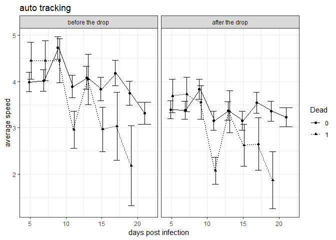<!-- -->

The dead ones are less active on average, especially later on in the
experiment, which seems realistic. However, treatment differences are
lumped together in the above plot. Infecteds are less active than
uninfecteds, and if they are also more likely to die, then that could
drive the difference. However, the proportion of copepods that died was
rather comparable across treatments.

    ## # A tibble: 3 x 4
    ## # Groups:   trt [3]
    ##   trt                 survived  died prop_dead
    ##   <fct>                  <int> <int>     <dbl>
    ## 1 unexposed, control        93    34     0.268
    ## 2 exposed, uninfected      357   121     0.253
    ## 3 infected                 327    86     0.208

Consequently, it is not surprising, that when we make the same plot, but
separate the treatments, we get a similar pattern. The copepods that
died exhibited somewhat lower activity levels, particularly later in the
experiment.

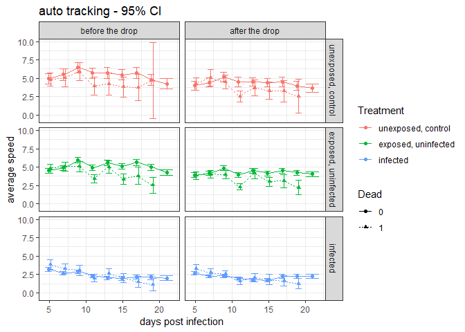<!-- -->

Is this reason enough to toss data from dead copepods? Copepods died at
different times during the experiment, so maybe their behavior only
conspicuously changes right before death. Let’s plot the behavioral
profiles of individual copepods that died during the experiment.
Activity across the experiment is shown for individual copepods (lines
connect values for individuals). The vertical panels separate copepods
by their time of
death.

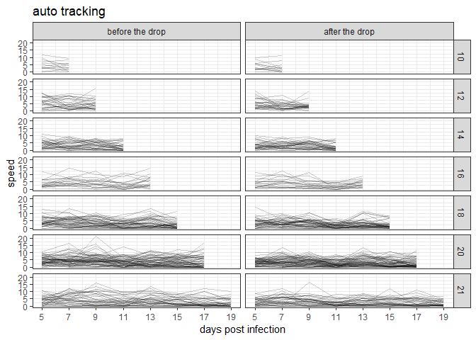<!-- -->

If copepods move less as they near death, then there should be an
overabundance of downward lines on the right edge of the plots. That’s
not obvious, which is partly attributed to the substantial variation
within individuals - activity measurements for a given copepod can
differ quite a lot from day to day. Maybe the pattern emerges when we
plot
averages.

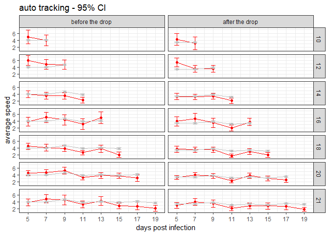<!-- -->

In the above plot, the average activity of copepods that died are red. I
also plotted the values for copepods that did not die in gray for
comparison. In some cases, copepod activity seems to drop as death
approaches (for copepods that died on days 21, 20, 18), but not in
others (days 16, 12, 10). Early in the experiment, when death is not
imminent for most copepods, there is little difference between the dead
and surviving copepods. Thus, my inclination is not to toss these data,
as the differences seem minor, particularly because the 25 host-parasite
genotype combinations cut the data relatively thin. Still, it also seems
prudent to re-run the final analysis excluding these copepods to ensure
that they do not bias the results.

# Treatment differences

Now let’s compare the behavior of infected and uninfected copepods over
the course of the
experiment.

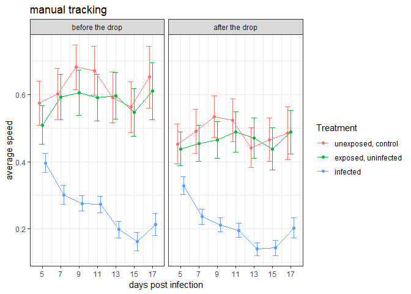<!-- -->
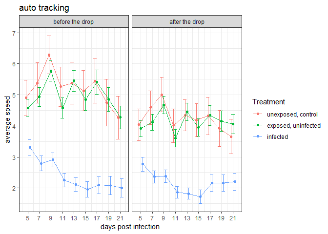<!-- -->

Infected copepods are less active than uninfected copepods, regardless
of days post infection. The worm becomes infective to its fish next host
at around 11 days post infection. Other [studies](HAMMERSCHmidT) have
found a conspicuous change in the behavior of infected copepods as worms
develop from uninfective to infective larvae. Specifically they switch
from reducing to increasing activity, relative to uninfecteds. However,
this switch seems to be population-dependent, and it is not observed in
the parasite population used in this experiment (see [here](HAFER)). In
any case, the behavioral changes appear to affect copepods’ predation
susceptibility (see [here]()) and consequently parasite transmission and
survival probabilities. Thus, the changes are likely to be fitness
components under selection.

The response to the plate drop looks fairly consistent over time, though
it is hard to gauge above. I plotted the change in activity in response
to the drop below. The response seems rather consistent in the
uninfected groups, while the infecteds seem to show less of a response
to the drop towards the end of the experiment. However, this could also
be because infecteds were slightly less active in general at the end of
the
experiment.

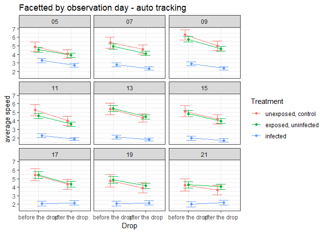<!-- -->
Modelling (see [here]()) suggested the effect of infection on the drop
response differed in manual and auto datasets. However, graphically they
are quite similar, and the difference probably arises due to sampling
more days in the auto-tracked data.
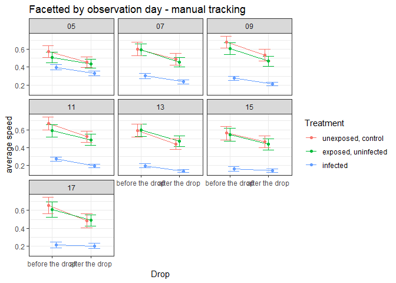<!-- -->

Our focus in this experiment is parasitic manipulation, i.e. how much
infected copepods differ from uninfected copepods. But to look at
genotype-by-genotype interactions we are restricted to using only
infected copepods (uninfected copepods have no associated parasite
genotype). So how should we define manipulation? I think there are two
ways. First and simplest, we can take the raw behavior values for
infected copepods, knowing that they differ from uninfecteds. Second and
somewhat more complex, we can express infected copepod behavior relative
to uninfected copepods, e.g. as a difference. In this first case, we
assume that the absolute magnitude of behavior is most relevant for the
parasite. In the second case, we consider manipulation in a relative
sense in that some hosts at some times may be more or less susceptible
to manipulation. We’ll start with the simpler case - how do host and
parasite genotypes affect infected copepod behavior?

# Manipulation in an absolute sense

Infected copepod activity differed among copepod genotypes, which were
inbred families in this
experiment.

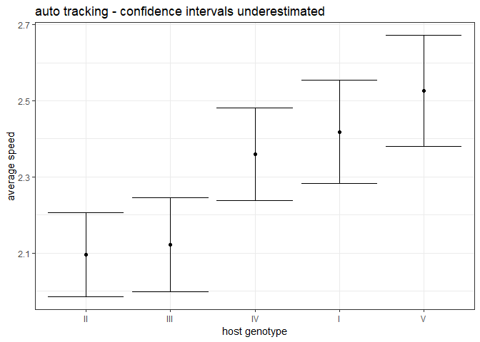<!-- -->
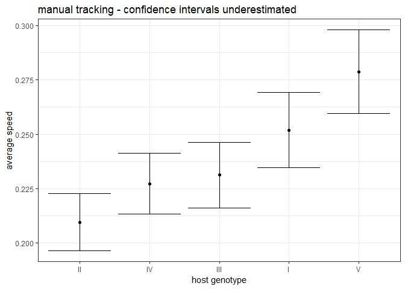<!-- -->
Similarly, different parasite genotypes, full-sib families in this case,
also exhibit different average activities. The overlap between parasite
genotypes appears smaller than that between hosts, which implies that
parasite genotype has a larger effect than host
genotype.

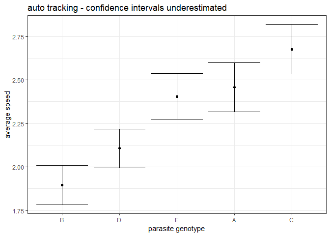<!-- -->
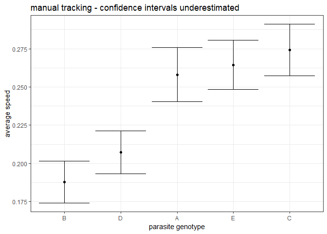<!-- -->

Now, we can plot host and parasite genotype simultaneously, i.e. their
interaction.

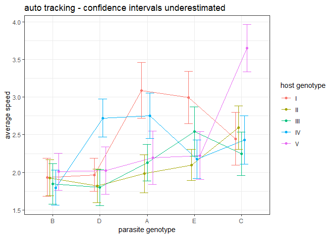<!-- -->

There appear to be both main effects (e.g. parasite genotype B is
associated with lower host activity than genotype C) and interactions
(e.g. some host genotypes show quite different behavior depending on the
parasite genotype). Judging from these initial plots, it looks like
parasite genotype has a clear effect, host genotype less so, and there
are interactions. In the last three plots, I noted that confidence
intervals were underestimated, and this is because I pooled together
multiple observations from the same copepod across the experiment.

If copepod behavior is temporally labile, then the effects of host and
parasite genotype could change over the experiment. Here is how the
activity of infected copepod genotypes varies over time. The relative
rank of genotypes varies quite a lot. For example, genotype IV shows the
lowest average activity on day 15 but the highest on day 21. It is also
interesting that the between genotype-variation appears smaller
initially than later in the experiment, i.e. the spread of the lines
seems larger after 9
dpi.

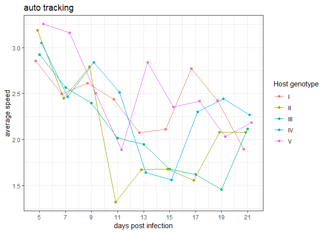<!-- -->

It is also worth remembering that these are all infected copepods. We
can also plot the behavior of uninfected copepods from the same
families. It is not obvious that certain copepod genotypes are
consistently more or less active, regardless of infection (i.e. the
colors vary a lot in their relative
position).

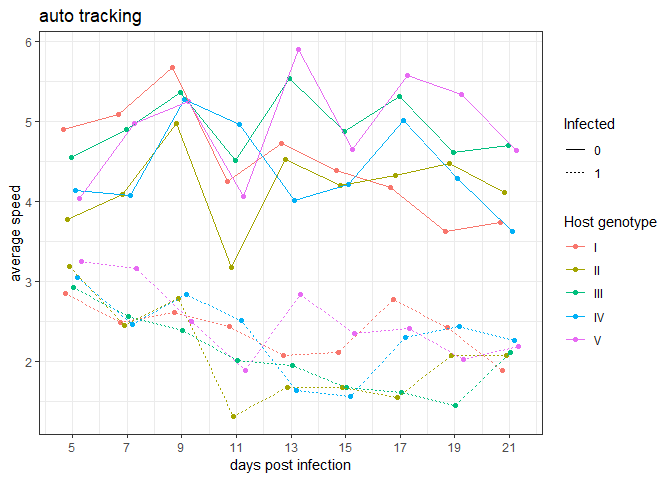<!-- -->

From the previous plot, it is hard to tell if copepod genotypes react
differently to infection. The next plot simply compares the average
activity of infected and uninfected copepods from the 5 genotypes. The
decrease in activity with infection is rather consistent, with perhaps
the exception of one genotype
(III).

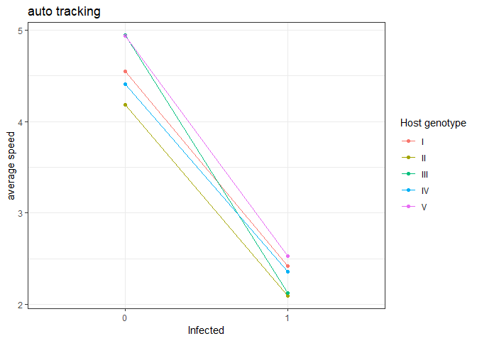<!-- -->

Differences among parasite genotypes appear a bit more consistent over
time, which supports the idea that parasite genotype more strongly
affects behavior than host genotype. However, the relative rank of
different genotypes still change over time. Thus, in our modelling
approach, we should also consider how genotype effects are
time-dependent.

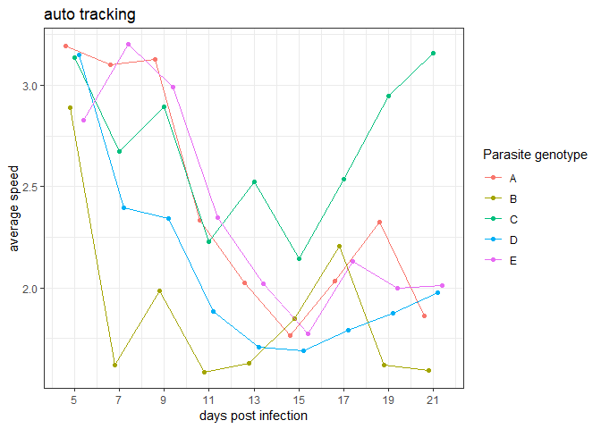<!-- -->

### Models

As a model-building approach, I fit a series of increasingly complex
models and then compare them to test specific hypotheses. The first
model can be considered a ‘null’ or ‘base’ model - it includes variables
that we are not specifically interested in, such as block of the
experiment, days post infection, whether activity is before or after the
drop, and individual copepod effects. The idea is to fit a model that
accounts for uninteresting variation (with regard to our primary goals),
and then to add host and parasite genotypes to the model to assess their
importance. I start with linear mixed models (individual copepod as
random effect), but acknowledge below that the distribution of the data
(right-skewed with an overabundance of zeros) might call for more
complex approaches.

I thought of three possible formulations for the base model. Fixed
effects were reaction to the drop, day post infection, and experimental
block, plus individual copepod as a random effect. Note that,
philosophically, block could be considered a random effect, but there
were only 3 blocks, so it has a small number of levels for a random
effect. That was the simplest model, and then I allowed the copepod
“drop reaction” to vary over time (days post infection) and by copepod
(individuals can have different typical reactions).

    ## Data: filter(bdr, trt == "infected")
    ## Models:
    ## lm_int: speed_per_sec ~ 1 + (1 | cop_name)
    ## lm0: speed_per_sec ~ box + rec_time + day_char + (1 | cop_name)
    ## lm0.1: speed_per_sec ~ box + rec_time * day_char + (1 | cop_name)
    ## lm0.2: speed_per_sec ~ box + rec_time * day_char + (1 | cop_name) + 
    ## lm0.2:     (rec_time | cop_name)
    ##        Df   AIC   BIC logLik deviance    Chisq Chi Df Pr(>Chisq)    
    ## lm_int  3 30076 30096 -15035    30070                               
    ## lm0    14 29865 29960 -14918    29837 233.1329     11  < 2.2e-16 ***
    ## lm0.1  22 29853 30003 -14904    29809  27.9870      8  0.0004767 ***
    ## lm0.2  25 29852 30023 -14901    29802   6.2718      3  0.0991109 .  
    ## ---
    ## Signif. codes:  0 '***' 0.001 '**' 0.01 '*' 0.05 '.' 0.1 ' ' 1

Letting the drop response vary by day post infection is an improvement.
As we say above, the response to the drop tends to decrease later in the
experiment, see [here](LINK). However, modelling copepod-specific
responses did not improve the model. We can visualize this by taking a
random sample of copepods and comparing how they responded to the
drop.

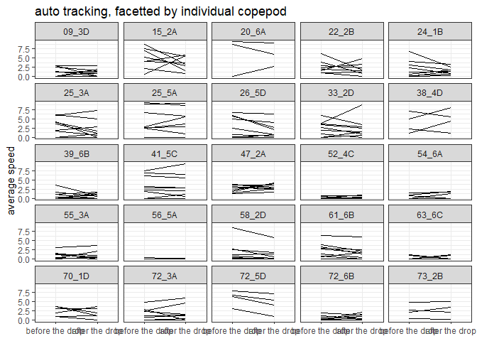<!-- -->

Each panel in the plot above is an individual copepod, and we see that
within panels there are quite a few crossing lines, indicating that
individuals do not always respond to the drop in the same way across the
multiple days of observation. However, there do appear to be some
copepods that are consistently more or less active than others. In other
words, there is variance due to individual differences, but there is not
variance due to individual ‘drop’ responses.

So, let’s take this as our base model: `speed_per_sec ~ box + rec_time *
day_char + (1|cop_name)` Next, we add the copepod and worm genotypes to
the model as main effects (no interactions). Do they significantly
improve the model?

    ## Data: filter(bdr, trt == "infected")
    ## Models:
    ## lm0.1: speed_per_sec ~ box + rec_time * day_char + (1 | cop_name)
    ## lm1: speed_per_sec ~ box + rec_time * day_char + cop_fam + parasite_fam + 
    ## lm1:     (1 | cop_name)
    ##       Df   AIC   BIC logLik deviance  Chisq Chi Df Pr(>Chisq)    
    ## lm0.1 22 29853 30003 -14904    29809                             
    ## lm1   30 29828 30033 -14884    29768 40.497      8  2.588e-06 ***
    ## ---
    ## Signif. codes:  0 '***' 0.001 '**' 0.01 '*' 0.05 '.' 0.1 ' ' 1

They do, suggesting that copepod activity is significantly affected by
either host genotype, parasite genotype, or both. Parasite genotype
seems to explain more variation than host genotype - its sum of squares
is almost three times as large.

    ## Analysis of Variance Table
    ##                   Df Sum Sq Mean Sq F value
    ## box                2  46.10  23.050  5.5859
    ## rec_time           1 107.13 107.131 25.9621
    ## day_char           8 833.20 104.151 25.2398
    ## cop_fam            4  49.79  12.446  3.0163
    ## parasite_fam       4 121.06  30.266  7.3347
    ## rec_time:day_char  8 115.43  14.429  3.4967

Next, we add the interaction between host and parasite genotype, which
was the primary interest of our experiment. It is significant as well,
but only marginally, and it appears less explanatory than the main
effects (i.e. it has a lower mean square).

    ## Data: filter(bdr, trt == "infected")
    ## Models:
    ## lm1: speed_per_sec ~ box + rec_time * day_char + cop_fam + parasite_fam + 
    ## lm1:     (1 | cop_name)
    ## lm2: speed_per_sec ~ box + rec_time * day_char + cop_fam * parasite_fam + 
    ## lm2:     (1 | cop_name)
    ##     Df   AIC   BIC logLik deviance  Chisq Chi Df Pr(>Chisq)  
    ## lm1 30 29828 30033 -14884    29768                           
    ## lm2 46 29832 30146 -14870    29740 28.535     16    0.02727 *
    ## ---
    ## Signif. codes:  0 '***' 0.001 '**' 0.01 '*' 0.05 '.' 0.1 ' ' 1

It is tempting to stop modelling here, because the results are
relatively straightforward. However, I took two additional modelling
steps. The first assesses whether copepod reaction to the drop is
genotype-dependent. Specifically, I added a three-way interaction
between host genotype, parasite genotype, and drop reaction. The goal is
to see if genotype combinations respond to our artifical scare in
different ways.

    ## Data: filter(bdr, trt == "infected")
    ## Models:
    ## lm2: speed_per_sec ~ box + rec_time * day_char + cop_fam * parasite_fam + 
    ## lm2:     (1 | cop_name)
    ## lm3: speed_per_sec ~ box + rec_time * day_char + cop_fam * parasite_fam * 
    ## lm3:     rec_time + (1 | cop_name)
    ##     Df   AIC   BIC logLik deviance  Chisq Chi Df Pr(>Chisq)
    ## lm2 46 29832 30146 -14870    29740                         
    ## lm3 70 29862 30341 -14861    29722 17.186     24     0.8406

It is not significant, and we can confirm that by plotting how each
genotype combo responds to the ‘shock’. The average response is in red,
overlaid on the individual reactions, and the average responses look
quite
comparable.

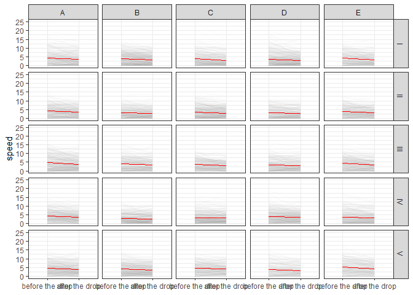<!-- -->

In the next and final modelling step, we allow host-parasite
interactions to vary across days of the experiment. In other words, the
effects of host and parasite genotypes can vary from day to day. This
consumes a huge number of degrees of freedom (5 host genotypes X 5
parasite genotypes x 9 observation days = 225 groups), and thus cuts the
data somewhat thin. Instead of jumping to the full genotype x genotype x
day interaction, we can use some biological knowledge to group the time
periods of the experiment. Worms were uninfective from 5 to 9 dpi,
developing infectivity from 11 to 15 dpi, and infective after 15 dpi. We
can thus group the days according to worm development. We can check if
letting genotype effects vary across these development groups improves
the model. I take a stepwise approach, first letting either host
genotype or parasite genotype vary with time, and then both.

Starting with copepod genotype, there is a significant interaction with
experiment day. We saw this [above]().

    ## Data: filter(bdr, trt == "infected")
    ## Models:
    ## lm2: speed_per_sec ~ box + rec_time * day_char + cop_fam * parasite_fam + 
    ## lm2:     (1 | cop_name)
    ## lm4c: speed_per_sec ~ box + rec_time * day_char + cop_fam * parasite_fam + 
    ## lm4c:     cop_fam * devo_period + (1 | cop_name)
    ##      Df   AIC   BIC logLik deviance  Chisq Chi Df Pr(>Chisq)    
    ## lm2  46 29832 30146 -14870    29740                             
    ## lm4c 54 29803 30172 -14848    29695 44.329      8   4.93e-07 ***
    ## ---
    ## Signif. codes:  0 '***' 0.001 '**' 0.01 '*' 0.05 '.' 0.1 ' ' 1

The parasite genotype by day interaction was also significant.
Interestingly, the magnitude of the effect was similar for host and
parasite genotypes, at least judged by the chi square test statistic.

    ## Data: filter(bdr, trt == "infected")
    ## Models:
    ## lm2: speed_per_sec ~ box + rec_time * day_char + cop_fam * parasite_fam + 
    ## lm2:     (1 | cop_name)
    ## lm4p: speed_per_sec ~ box + rec_time * day_char + cop_fam * parasite_fam + 
    ## lm4p:     parasite_fam * devo_period + (1 | cop_name)
    ##      Df   AIC   BIC logLik deviance  Chisq Chi Df Pr(>Chisq)    
    ## lm2  46 29832 30146 -14870    29740                             
    ## lm4p 54 29810 30179 -14851    29702 37.117      8  1.095e-05 ***
    ## ---
    ## Signif. codes:  0 '***' 0.001 '**' 0.01 '*' 0.05 '.' 0.1 ' ' 1

Finally, we allowed genotype-genotype interactions to vary over time.
Despite the huge number of df this eats up, this model was a significant
improvement over models with just a parasite genotype x day interaction
or just a copepod genotype x day interaction.

    ## Data: filter(bdr, trt == "infected")
    ## Models:
    ## lm4c: speed_per_sec ~ box + rec_time * day_char + cop_fam * parasite_fam + 
    ## lm4c:     cop_fam * devo_period + (1 | cop_name)
    ## lm4g: speed_per_sec ~ box + rec_time * day_char + cop_fam * parasite_fam + 
    ## lm4g:     cop_fam * devo_period + parasite_fam * devo_period + cop_fam * 
    ## lm4g:     parasite_fam * devo_period + (1 | cop_name)
    ##      Df   AIC   BIC logLik deviance  Chisq Chi Df Pr(>Chisq)    
    ## lm4c 54 29803 30172 -14848    29695                             
    ## lm4g 94 29776 30418 -14794    29588 107.24     40  4.661e-08 ***
    ## ---
    ## Signif. codes:  0 '***' 0.001 '**' 0.01 '*' 0.05 '.' 0.1 ' ' 1

    ## Data: filter(bdr, trt == "infected")
    ## Models:
    ## lm4p: speed_per_sec ~ box + rec_time * day_char + cop_fam * parasite_fam + 
    ## lm4p:     parasite_fam * devo_period + (1 | cop_name)
    ## lm4g: speed_per_sec ~ box + rec_time * day_char + cop_fam * parasite_fam + 
    ## lm4g:     cop_fam * devo_period + parasite_fam * devo_period + cop_fam * 
    ## lm4g:     parasite_fam * devo_period + (1 | cop_name)
    ##      Df   AIC   BIC logLik deviance  Chisq Chi Df Pr(>Chisq)    
    ## lm4p 54 29810 30179 -14851    29702                             
    ## lm4g 94 29776 30418 -14794    29588 114.46     40  4.225e-09 ***
    ## ---
    ## Signif. codes:  0 '***' 0.001 '**' 0.01 '*' 0.05 '.' 0.1 ' ' 1

This suggests genotype effects are time-dependent. And in terms of the
variance explained, the genotype by time interactions (the last 3
entries in the ANOVA table below) seem to have a comparable magnitude to
the main effects of host and parasite genotype.

    ## Analysis of Variance Table
    ##                                  Df Sum Sq Mean Sq F value
    ## box                               2  46.25  23.126  5.6983
    ## rec_time                          1 107.13 107.131 26.3971
    ## day_char                          8 833.36 104.170 25.6674
    ## cop_fam                           4  49.95  12.486  3.0767
    ## parasite_fam                      4 121.50  30.374  7.4841
    ## rec_time:day_char                 8 115.43  14.429  3.5553
    ## cop_fam:parasite_fam             16 111.18   6.949  1.7121
    ## cop_fam:devo_period               8 182.62  22.828  5.6248
    ## parasite_fam:devo_period          8 166.12  20.765  5.1165
    ## cop_fam:parasite_fam:devo_period 32 268.39   8.387  2.0666

Here’s an attempt to visualize these effects, starting with parasite
genotype effects. Differences among parasite genotype look relatively
consistent except for genotype C, which is especially active towards the
end of the
experiment.

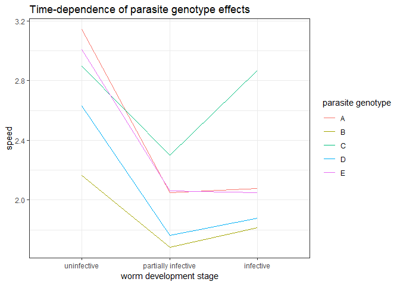<!-- -->

Though it doesn’t come through in the stats, host genotype effects
appear more variable (more line crossing). The variation attributable to
host genotype also appears low at the beginning of the experiment
compared to the end of the
experiment.

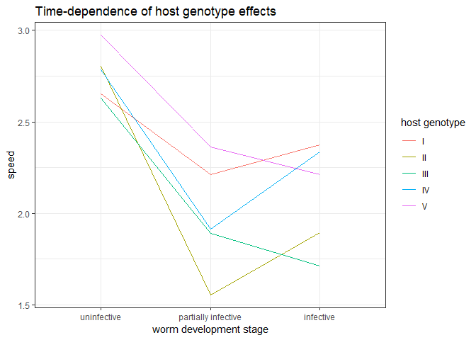<!-- -->

Genotype by genotype interactions were also significant. This is
challenging to visualize given the large number of combinations (25
genotype combos x 3 devo times = 75 groups\!), but here’s an attempt.
Hopefully it shows that (i) host genotype effects are time dependent
(within a panel there can be simultaneous peaks and dips for several
parasite genotypes), that (ii) parasite genotype effects are time
dependent (certain colors are not consistently high or low across time),
and that host-parasite interactions vary over time (colors, vary in
their position from panel to
panel).

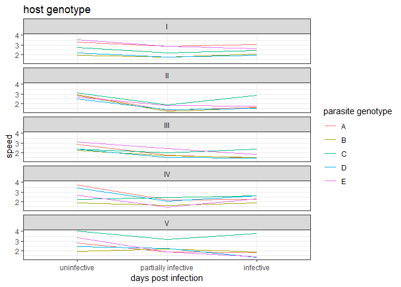<!-- -->

We should also make sure we are ignoring too much variation by just
pooling the different days of the experiment according to worm
developmental stage. Let’s fit the same models, but allow genotype to
vary by dpi instead of developmental period. This consumes a huge number
of degrees of freedom, but in every comparison, allowing genotype
effects to vary by day was an improvement over just allowing them to
vary by developmental period.

    ## Data: filter(bdr, trt == "infected")
    ## Models:
    ## lm4c: speed_per_sec ~ box + rec_time * day_char + cop_fam * parasite_fam + 
    ## lm4c:     cop_fam * devo_period + (1 | cop_name)
    ## lm5c: speed_per_sec ~ box + rec_time * day_char + cop_fam * parasite_fam + 
    ## lm5c:     cop_fam * day_char + (1 | cop_name)
    ##      Df   AIC   BIC logLik deviance  Chisq Chi Df Pr(>Chisq)    
    ## lm4c 54 29803 30172 -14848    29695                             
    ## lm5c 78 29767 30300 -14806    29611 84.174     24  1.298e-08 ***
    ## ---
    ## Signif. codes:  0 '***' 0.001 '**' 0.01 '*' 0.05 '.' 0.1 ' ' 1

    ## Data: filter(bdr, trt == "infected")
    ## Models:
    ## lm4p: speed_per_sec ~ box + rec_time * day_char + cop_fam * parasite_fam + 
    ## lm4p:     parasite_fam * devo_period + (1 | cop_name)
    ## lm5p: speed_per_sec ~ box + rec_time * day_char + cop_fam * parasite_fam + 
    ## lm5p:     parasite_fam * day_char + (1 | cop_name)
    ##      Df   AIC   BIC logLik deviance  Chisq Chi Df Pr(>Chisq)    
    ## lm4p 54 29810 30179 -14851    29702                             
    ## lm5p 78 29791 30323 -14817    29635 67.986     24  4.395e-06 ***
    ## ---
    ## Signif. codes:  0 '***' 0.001 '**' 0.01 '*' 0.05 '.' 0.1 ' ' 1

    ## Data: filter(bdr, trt == "infected")
    ## Models:
    ## lm4g: speed_per_sec ~ box + rec_time * day_char + cop_fam * parasite_fam + 
    ## lm4g:     cop_fam * devo_period + parasite_fam * devo_period + cop_fam * 
    ## lm4g:     parasite_fam * devo_period + (1 | cop_name)
    ## lm5g: speed_per_sec ~ box + rec_time * day_char + cop_fam * parasite_fam + 
    ## lm5g:     cop_fam * day_char + parasite_fam * day_char + cop_fam * 
    ## lm5g:     parasite_fam * day_char + (1 | cop_name)
    ##       Df   AIC   BIC logLik deviance  Chisq Chi Df Pr(>Chisq)    
    ## lm4g  94 29776 30418 -14794    29588                             
    ## lm5g 238 29737 31362 -14630    29261 327.16    144  2.797e-16 ***
    ## ---
    ## Signif. codes:  0 '***' 0.001 '**' 0.01 '*' 0.05 '.' 0.1 ' ' 1

Since genotype x genotype interactions were time dependent, one
additional twist to consider is whether responses to the drop were too.
I added a 4-way interaction between host genotype, parasite genotype,
day post infection, and drop response, but this did not further improve
the model, which supports the idea that drop responses are relatively
unaffected by genotype, even when accounting for their time-dependence.

    ## Data: filter(bdr, trt == "infected")
    ## Models:
    ## lm5g: speed_per_sec ~ box + rec_time * day_char + cop_fam * parasite_fam + 
    ## lm5g:     cop_fam * day_char + parasite_fam * day_char + cop_fam * 
    ## lm5g:     parasite_fam * day_char + (1 | cop_name)
    ## lm6: speed_per_sec ~ box + rec_time * day_char + cop_fam * parasite_fam * 
    ## lm6:     day_char * rec_time + (1 | cop_name)
    ##       Df   AIC   BIC logLik deviance  Chisq Chi Df Pr(>Chisq)
    ## lm5g 238 29737 31362 -14630    29261                         
    ## lm6  454 30045 33146 -14569    29137 123.71    216          1

So what did we learn from this modeling exercise? Both host genotype,
parasite genotype, and their interaction affect copepod behavior.
Additionally, these effects seem to vary over the course of the
experiment, such that a genotype combination could be comparatively
active on one day and relatively inactive the next. The response to our
experimental scare tactic, the plate drop, seems time-dependent but not
genotype-dependent.

# Manipulation relative to uninfecteds

Arguably, manipulation should be quantified not in absolute terms, but
relative to an expectation, namely the behavior of uninfected copepods.
We had two groups of uninfected copepods: unexposed controls and
exposed-but-uninfected copepods. Their behavior was very similar, which
is consistent with other experiments on this system. Exposure, in
itself, does not seem to affect copepod
behavior.

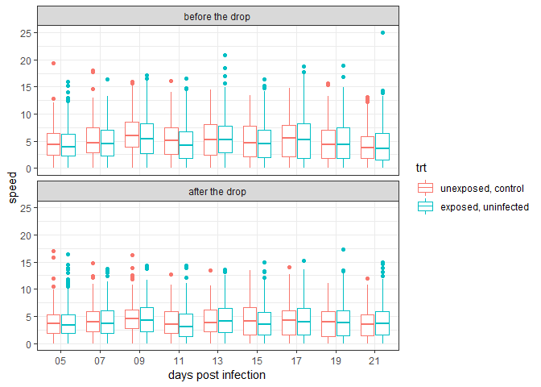<!-- -->

Presumably, we can combine these two groups. Taking the base model
defined earlier, we check if splitting the uninfected copepods into two
groups improves the model. It does not, so for simplicity we combine the
two groups of uninfected copepods.

    ## Data: filter(bdr, trt != "infected", !is.na(trt))
    ## Models:
    ## lmu: speed_per_sec ~ box + rec_time * day_char + (1 | cop_name)
    ## lmut: speed_per_sec ~ box + rec_time * day_char + trt + (1 | cop_name)
    ##      Df   AIC   BIC logLik deviance  Chisq Chi Df Pr(>Chisq)
    ## lmu  22 48262 48420 -24109    48218                         
    ## lmut 23 48263 48428 -24109    48217 1.0777      1     0.2992

Some copepod genotypes may be more active than others, so a worm may
have to manipulate hosts that have different baseline behaviors. If
parasites invest in manipulation the same, regardless of host
background, then there should be a positive correlation between the
behavior of copepod genotypes when infected and uninfected. We can plot
this relationship, and we can do so by splitting the data to different
degrees. First, let’s just average activity over the whole experiment
for copepod genotypes when infected and
uninfected.

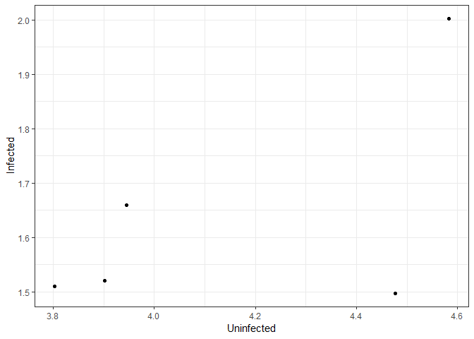<!-- -->

    ## 
    ##  Spearman's rank correlation rho
    ## 
    ## data:  bdr_avg$speed_inf_mean and bdr_avg$speed_uninf_mean
    ## S = 12, p-value = 0.5167
    ## alternative hypothesis: true rho is not equal to 0
    ## sample estimates:
    ## rho 
    ## 0.4

There is a positive, non-significant correlation - one genotype in
particular seems active regardless of infection status. Next, we split
the data by day, averaging activity for each dpi for each
genotype.

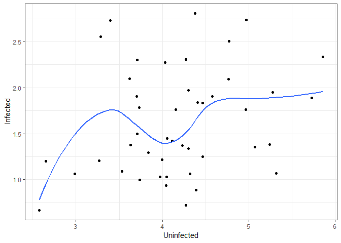<!-- -->

    ## 
    ##  Spearman's rank correlation rho
    ## 
    ## data:  bdr_avg$speed_inf_mean and bdr_avg$speed_uninf_mean
    ## S = 11522, p-value = 0.1107
    ## alternative hypothesis: true rho is not equal to 0
    ## sample estimates:
    ##      rho 
    ## 0.240975

Again the correlation is positive, but not significant. Finally, we
split the data by dpi and recording period (before or after the
drop).

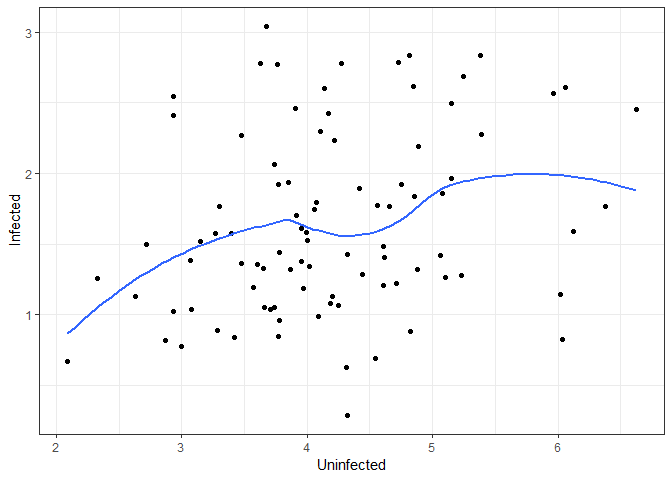<!-- -->

    ## 
    ##  Spearman's rank correlation rho
    ## 
    ## data:  bdr_avg$speed_inf_mean and bdr_avg$speed_uninf_mean
    ## S = 87504, p-value = 0.007762
    ## alternative hypothesis: true rho is not equal to 0
    ## sample estimates:
    ##       rho 
    ## 0.2797135

The magnitude of the correlation is about the same, but it is now
considered significant due to the increase in df. These correlations
suggest that there is a weak positive relationship between the behavior
of copepod genotypes when infected and uninfected. In other words,
(in)active copepod genotypes tend to be (in)active, regardless of
whether they are infected, but there is quite a lot of variation. Some
of this variation can be explained by dpi - the difference between
infected and uninfected copepods was not constant over the whole
experiment. But some could also be due to parasite genotype - either
some manipulate more than others or they exhibit interactions with host
genotypes.

## Models

To better understand the relationships between infection, host genotype,
parasite genotype, and behavior, let’s take a model-building approach
similar to the one above for just infected copepods.

We can start with the same base model. It includes a copepod individual
random effect, and the fixed effects of box, dpi, recording time, and
the interaction between dpi and recording time. We then add infection,
which is obviously highly significant. We can also add further terms to
explore how infection affects copepod behavior, such as an interaction
between infection and recording period (before or after the drop). This
term is also significant, because infected copepods respond less to the
drop, mainly because they are less active to begin with. Then, we let
the difference between infected and uninfected copepods vary across the
days of the experiment. This is also significant, because infected were
more active, and thus more similar to uninfecteds, at the outset of the
experiment. Finally, we let the response to the drop vary by day and
infection. This term was not significant, suggesting the effect of
infection on the drop response was rather constant across the 21 days of
the experiment.

    ## Data: bdr
    ## Models:
    ## lmu0: speed_per_sec ~ box + rec_time * day_char + (1 | cop_name)
    ## lmu1: speed_per_sec ~ box + rec_time * day_char + infection + (1 | 
    ## lmu1:     cop_name)
    ## lmu1.1: speed_per_sec ~ box + rec_time * day_char + infection * rec_time + 
    ## lmu1.1:     (1 | cop_name)
    ## lmu1.2: speed_per_sec ~ box + rec_time * day_char + infection * rec_time + 
    ## lmu1.2:     infection * day_char + (1 | cop_name)
    ## lmu1.3: speed_per_sec ~ box + rec_time * day_char + infection * rec_time * 
    ## lmu1.3:     day_char + (1 | cop_name)
    ##        Df   AIC   BIC logLik deviance   Chisq Chi Df Pr(>Chisq)    
    ## lmu0   22 79329 79499 -39643    79285                              
    ## lmu1   23 78970 79147 -39462    78924 361.226      1  < 2.2e-16 ***
    ## lmu1.1 24 78909 79094 -39430    78861  63.312      1  1.765e-15 ***
    ## lmu1.2 32 78761 79008 -39349    78697 163.308      8  < 2.2e-16 ***
    ## lmu1.3 40 78766 79074 -39343    78686  11.576      8     0.1711    
    ## ---
    ## Signif. codes:  0 '***' 0.001 '**' 0.01 '*' 0.05 '.' 0.1 ' ' 1

So compared to uninfected copepods, infecteds are less active, though
this varies somewhat from day to day, and respond less to a drop.
Looking at absolute effect sizes (sum sq), we can see that, of the
infection effects, the main effect of infection is most important,
followed by the infection x dpi interaction, and then the infection x
recording period interaction.

    ## Analysis of Variance Table
    ##                             Df  Sum Sq Mean Sq  F value
    ## box                          2  429.60  214.80  36.1582
    ## rec_time                     1 1564.62 1564.62 263.3769
    ## day_char                     8 1334.11  166.76  28.0718
    ## infection                    1 2590.46 2590.46 436.0600
    ## rec_time:day_char            8  184.92   23.12   3.8911
    ## rec_time:infection           1  380.26  380.26  64.0112
    ## day_char:infection           8  973.74  121.72  20.4892
    ## rec_time:day_char:infection  8   68.65    8.58   1.4444

Now, we have a model that includes the impact of infection. We want to
see if additional variation is explained by host genotype. The main
effect of copepod genotype is significant, indicating differences
between our inbred lines. Interestingly, the effect of copepod genotype
does not vary with infection - the infection x copepod genotype
interaction was not significant. Neither was an infection x drop x
copepod genotype interaction, indicating genotypes tend to respond
similarly to the drop.

    ## Data: bdr
    ## Models:
    ## lmu1.2: speed_per_sec ~ box + rec_time * day_char + infection * rec_time + 
    ## lmu1.2:     infection * day_char + (1 | cop_name)
    ## lmu2: speed_per_sec ~ box + rec_time * day_char + infection * rec_time + 
    ## lmu2:     infection * day_char + cop_fam + (1 | cop_name)
    ## lmu2.1: speed_per_sec ~ box + rec_time * day_char + infection * rec_time + 
    ## lmu2.1:     infection * day_char + infection * cop_fam + (1 | cop_name)
    ## lmu2.2: speed_per_sec ~ box + rec_time * day_char + infection * rec_time + 
    ## lmu2.2:     infection * day_char + infection * cop_fam * rec_time + (1 | 
    ## lmu2.2:     cop_name)
    ##        Df   AIC   BIC logLik deviance   Chisq Chi Df Pr(>Chisq)    
    ## lmu1.2 32 78761 79008 -39349    78697                              
    ## lmu2   36 78736 79014 -39332    78664 32.9544      4   1.22e-06 ***
    ## lmu2.1 40 78737 79046 -39329    78657  6.9958      4     0.1361    
    ## lmu2.2 48 78741 79111 -39322    78645 12.4147      8     0.1336    
    ## ---
    ## Signif. codes:  0 '***' 0.001 '**' 0.01 '*' 0.05 '.' 0.1 ' ' 1

Copepod genotypes that are active when uninfected are also relatively
active when infected. The decrease in activity in response to the drop
is also rather consistent across
genotypes.

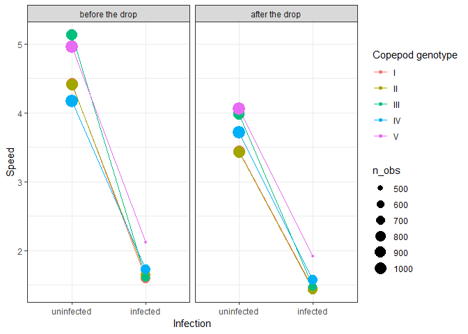<!-- -->

Next, we want to add parasite genotype to the model. Even though copepod
genotype effects did not depend on infection, we retain this interaction
in the model, so that separate means are estimated for infected and
uninfected copepods of each genotype. Unlike for copepod family, in
which the levels are represented in both uninfected and infected
copepods, the levels of parasite family are only relevant within the
infected copepods. Thus, by adding parasite family to the model, we
essentially split infected copepods by worm genotype to see if this
explains additional variation. It does. And just like for host genotype,
parasite genotypes do not respond differently to the drop.

    ## Data: bdr
    ## Models:
    ## lmu2.1: speed_per_sec ~ box + rec_time * day_char + infection * rec_time + 
    ## lmu2.1:     infection * day_char + infection * cop_fam + (1 | cop_name)
    ## lmu3: speed_per_sec ~ box + rec_time * day_char + infection * rec_time + 
    ## lmu3:     infection * day_char + infection * cop_fam + parasite_fam2 + 
    ## lmu3:     (1 | cop_name)
    ## lmu3.1: speed_per_sec ~ box + rec_time * day_char + infection * rec_time + 
    ## lmu3.1:     infection * day_char + infection * cop_fam + parasite_fam2 * 
    ## lmu3.1:     rec_time + (1 | cop_name)
    ##        Df   AIC   BIC logLik deviance   Chisq Chi Df Pr(>Chisq)    
    ## lmu2.1 40 78737 79046 -39329    78657                              
    ## lmu3   44 78720 79060 -39316    78632 25.3594      4   4.26e-05 ***
    ## lmu3.1 48 78725 79095 -39314    78629  3.3123      4      0.507    
    ## ---
    ## Signif. codes:  0 '***' 0.001 '**' 0.01 '*' 0.05 '.' 0.1 ' ' 1

Next, we add the interaction between host and parasite genotype. It is
not significant. Allowing genotype combinations to vary in their drop
response was also not an improvement. This suggests that parasite
genotype effects were not dependent on host genotype and vice versa.

    ## Data: bdr
    ## Models:
    ## lmu3: speed_per_sec ~ box + rec_time * day_char + infection * rec_time + 
    ## lmu3:     infection * day_char + infection * cop_fam + parasite_fam2 + 
    ## lmu3:     (1 | cop_name)
    ## lmu4: speed_per_sec ~ box + rec_time * day_char + infection * rec_time + 
    ## lmu4:     infection * day_char + infection * cop_fam * parasite_fam2 + 
    ## lmu4:     (1 | cop_name)
    ## lmu4.1: speed_per_sec ~ box + rec_time * day_char + infection * rec_time + 
    ## lmu4.1:     infection * day_char + infection * cop_fam * parasite_fam2 * 
    ## lmu4.1:     rec_time + (1 | cop_name)
    ##        Df   AIC   BIC logLik deviance  Chisq Chi Df Pr(>Chisq)
    ## lmu3   44 78720 79060 -39316    78632                         
    ## lmu4   60 78737 79200 -39308    78617 15.134     16     0.5149
    ## lmu4.1 88 78772 79451 -39298    78596 21.239     28     0.8152

The analysis of just the infected copepods suggested that genotype
effects (the two main effects and their interaction), varied over the
experiment. Let’s add this time dependence, starting with using worm
developmental period as the grouping variable. Allowing copepod genotype
effects to vary over time was a significant improvement, as was allowing
infected and uninfected copepods in each genotype to differ.

    ## Data: bdr
    ## Models:
    ## lmu4: speed_per_sec ~ box + rec_time * day_char + infection * rec_time + 
    ## lmu4:     infection * day_char + infection * cop_fam * parasite_fam2 + 
    ## lmu4:     (1 | cop_name)
    ## lmu5c: speed_per_sec ~ box + rec_time * day_char + infection * rec_time + 
    ## lmu5c:     infection * day_char + infection * cop_fam * parasite_fam2 + 
    ## lmu5c:     cop_fam:devo_period + (1 | cop_name)
    ## lmu5c2: speed_per_sec ~ box + rec_time * day_char + infection * rec_time + 
    ## lmu5c2:     infection * day_char + infection * cop_fam * parasite_fam2 + 
    ## lmu5c2:     infection:cop_fam:devo_period + (1 | cop_name)
    ##        Df   AIC   BIC logLik deviance  Chisq Chi Df Pr(>Chisq)    
    ## lmu4   60 78737 79200 -39308    78617                             
    ## lmu5c  68 78694 79219 -39279    78558 59.139      8  6.874e-10 ***
    ## lmu5c2 76 78622 79209 -39235    78470 87.306      8  1.636e-15 ***
    ## ---
    ## Signif. codes:  0 '***' 0.001 '**' 0.01 '*' 0.05 '.' 0.1 ' ' 1

Allowing parasite genotype effects to vary over time was also
significant, though less so than for hosts.

    ## Data: bdr
    ## Models:
    ## lmu4: speed_per_sec ~ box + rec_time * day_char + infection * rec_time + 
    ## lmu4:     infection * day_char + infection * cop_fam * parasite_fam2 + 
    ## lmu4:     (1 | cop_name)
    ## lmu5p: speed_per_sec ~ box + rec_time * day_char + infection * rec_time + 
    ## lmu5p:     infection * day_char + infection * cop_fam * parasite_fam2 + 
    ## lmu5p:     parasite_fam2:devo_period + (1 | cop_name)
    ##       Df   AIC   BIC logLik deviance Chisq Chi Df Pr(>Chisq)   
    ## lmu4  60 78737 79200 -39308    78617                           
    ## lmu5p 68 78727 79252 -39296    78591 25.41      8   0.001324 **
    ## ---
    ## Signif. codes:  0 '***' 0.001 '**' 0.01 '*' 0.05 '.' 0.1 ' ' 1

Allowing time-dependent genotype by genotype effects was also an
improvement over the two models with only time-dependent main effects.

    ## Data: bdr
    ## Models:
    ## lmu5p: speed_per_sec ~ box + rec_time * day_char + infection * rec_time + 
    ## lmu5p:     infection * day_char + infection * cop_fam * parasite_fam2 + 
    ## lmu5p:     parasite_fam2:devo_period + (1 | cop_name)
    ## lmu5g: speed_per_sec ~ box + rec_time * day_char + infection * rec_time + 
    ## lmu5g:     infection * day_char + infection * cop_fam * parasite_fam2 + 
    ## lmu5g:     infection:cop_fam:parasite_fam2:devo_period + (1 | cop_name)
    ##        Df   AIC   BIC logLik deviance  Chisq Chi Df Pr(>Chisq)    
    ## lmu5p  68 78727 79252 -39296    78591                             
    ## lmu5g 116 78628 79523 -39198    78396 195.43     48  < 2.2e-16 ***
    ## ---
    ## Signif. codes:  0 '***' 0.001 '**' 0.01 '*' 0.05 '.' 0.1 ' ' 1

    ## Data: bdr
    ## Models:
    ## lmu5c2: speed_per_sec ~ box + rec_time * day_char + infection * rec_time + 
    ## lmu5c2:     infection * day_char + infection * cop_fam * parasite_fam2 + 
    ## lmu5c2:     infection:cop_fam:devo_period + (1 | cop_name)
    ## lmu5g: speed_per_sec ~ box + rec_time * day_char + infection * rec_time + 
    ## lmu5g:     infection * day_char + infection * cop_fam * parasite_fam2 + 
    ## lmu5g:     infection:cop_fam:parasite_fam2:devo_period + (1 | cop_name)
    ##         Df   AIC   BIC logLik deviance  Chisq Chi Df Pr(>Chisq)    
    ## lmu5c2  76 78622 79209 -39235    78470                             
    ## lmu5g  116 78628 79523 -39198    78396 74.395     40  0.0007764 ***
    ## ---
    ## Signif. codes:  0 '***' 0.001 '**' 0.01 '*' 0.05 '.' 0.1 ' ' 1

When we fit the same models with dpi instead of worm developmental
period, it is a further improvement, regardless of whether copepod
genotype, parasite genotype, or both were time dependent.

    ## Data: bdr
    ## Models:
    ## lmu5c: speed_per_sec ~ box + rec_time * day_char + infection * rec_time + 
    ## lmu5c:     infection * day_char + infection * cop_fam * parasite_fam2 + 
    ## lmu5c:     cop_fam:devo_period + (1 | cop_name)
    ## lmu6c: speed_per_sec ~ box + rec_time * day_char + infection * rec_time + 
    ## lmu6c:     infection * day_char + infection * cop_fam * parasite_fam2 + 
    ## lmu6c:     cop_fam:day_char + (1 | cop_name)
    ##       Df   AIC   BIC logLik deviance  Chisq Chi Df Pr(>Chisq)    
    ## lmu5c 68 78694 79219 -39279    78558                             
    ## lmu6c 92 78587 79297 -39201    78403 154.98     24  < 2.2e-16 ***
    ## ---
    ## Signif. codes:  0 '***' 0.001 '**' 0.01 '*' 0.05 '.' 0.1 ' ' 1

    ## Data: bdr
    ## Models:
    ## lmu5c2: speed_per_sec ~ box + rec_time * day_char + infection * rec_time + 
    ## lmu5c2:     infection * day_char + infection * cop_fam * parasite_fam2 + 
    ## lmu5c2:     infection:cop_fam:devo_period + (1 | cop_name)
    ## lmu6c2: speed_per_sec ~ box + rec_time * day_char + infection * rec_time + 
    ## lmu6c2:     infection * day_char + infection * cop_fam * parasite_fam2 + 
    ## lmu6c2:     infection:cop_fam:day_char + (1 | cop_name)
    ##         Df   AIC   BIC logLik deviance  Chisq Chi Df Pr(>Chisq)    
    ## lmu5c2  76 78622 79209 -39235    78470                             
    ## lmu6c2 124 78525 79482 -39139    78277 193.29     48  < 2.2e-16 ***
    ## ---
    ## Signif. codes:  0 '***' 0.001 '**' 0.01 '*' 0.05 '.' 0.1 ' ' 1

    ## Data: bdr
    ## Models:
    ## lmu5p: speed_per_sec ~ box + rec_time * day_char + infection * rec_time + 
    ## lmu5p:     infection * day_char + infection * cop_fam * parasite_fam2 + 
    ## lmu5p:     parasite_fam2:devo_period + (1 | cop_name)
    ## lmu6p: speed_per_sec ~ box + rec_time * day_char + infection * rec_time + 
    ## lmu6p:     infection * day_char + infection * cop_fam * parasite_fam2 + 
    ## lmu6p:     parasite_fam2:day_char + (1 | cop_name)
    ##       Df   AIC   BIC logLik deviance  Chisq Chi Df Pr(>Chisq)   
    ## lmu5p 68 78727 79252 -39296    78591                            
    ## lmu6p 92 78729 79439 -39272    78545 46.821     24   0.003523 **
    ## ---
    ## Signif. codes:  0 '***' 0.001 '**' 0.01 '*' 0.05 '.' 0.1 ' ' 1

    ## Data: bdr
    ## Models:
    ## lmu5g: speed_per_sec ~ box + rec_time * day_char + infection * rec_time + 
    ## lmu5g:     infection * day_char + infection * cop_fam * parasite_fam2 + 
    ## lmu5g:     infection:cop_fam:parasite_fam2:devo_period + (1 | cop_name)
    ## lmu6g: speed_per_sec ~ box + rec_time * day_char + infection * rec_time + 
    ## lmu6g:     infection * day_char + infection * cop_fam * parasite_fam2 + 
    ## lmu6g:     infection:cop_fam:parasite_fam2:day_char + (1 | cop_name)
    ##        Df   AIC   BIC logLik deviance  Chisq Chi Df Pr(>Chisq)    
    ## lmu5g 116 78628 79523 -39198    78396                             
    ## lmu6g 284 78607 80798 -39019    78039 357.48    168  9.537e-16 ***
    ## ---
    ## Signif. codes:  0 '***' 0.001 '**' 0.01 '*' 0.05 '.' 0.1 ' ' 1

These results suggest that copepod behavior varies quite a lot from day
to day among the genotypes. In an absolute sense (sum of squares), these
genotype x time interactions explain a lot of variation, which they
should since they use so many df (224\!). But in a relative sense (mean
square), they are one of the least important terms in the model. My
feeling is that this is an overparameterized model.

    ## Analysis of Variance Table
    ##                       Df  Sum Sq Mean Sq  F value
    ## box                    2  445.51  222.75  37.9348
    ## rec_time               1 1564.62 1564.62 266.4517
    ## day_char               8 1334.40  166.80  28.4058
    ## infection              1 2690.68 2690.68 458.2181
    ## cop_fam                4  199.89   49.97   8.5101
    ## parasite_fam2          4  136.71   34.18   5.8202
    ## rec_time:day_char      8  184.92   23.12   3.9365
    ## rec_time:infection     1  380.26  380.26  64.7585
    ## day_char:infection     8  976.25  122.03  20.7817
    ## infection:cop_fam      4   49.85   12.46   2.1222
    ## cop_fam:parasite_fam2 16   86.65    5.42   0.9223
    ## day_char:cop_fam      32 1261.50   39.42   6.7135

When we plot the data, we can see how genotype effects are not
temporally consistent. In this plot, each line is a genotype combination
(so just copepod genotype for uninfected copepods; copepod x worm
genotype combination for infecteds). The jumble of lines indicates that
genotypes do not behave consistently throughout the
experiment.

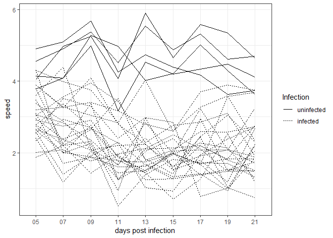<!-- -->

I am not quite sure how to interpret this. On the one hand, it might
just be noise. Behavior varies from day to day and this is not
interesting or unexpected. The variation was not associated with worm
development, given that the models improved so much by using dpi,
instead of worm development, making intepretation murky. On the other
hand, just because it is hard to explain does not mean it has no
biological relevance. Genotypes that manipulate strongly at one point in
the experiment may not manipulate much at other times in the experiment.
Maybe we can better put these results into context by looking at effect
sizes.

# The variance explained by different predictors

To examine how important different effects are in the model, I calculate
R2 values for each model, according to these [suggestions]().
I calculate two versions of R2, marginal and conditional
R2. Marginal R2 is the variance explained by just
the fixed effects, while conditiona R2 is the variance
explained by fixed and random effects together, i.e. all the predictors
in the model. The random effect in this case is the variation between
copepod individuals.

We’ll start by looking at the models in which both uninfected and
infected copepods were included. For every model-building step, we
calculate the R2 and df used. By comparing the change in
R2 as we add predictors, we can get a feeling for how
important they are, how much information they add.

    ## # A tibble: 8 x 5
    ##   step                           df_used marg_r2 cond_r2 cop_ind_var_expla~
    ##   <chr>                            <dbl>   <dbl>   <dbl>              <dbl>
    ## 1 intercept                           NA   0       0.379              0.379
    ## 2 base                                19   0.038   0.399              0.361
    ## 3 infection                           10   0.168   0.407              0.239
    ## 4 copepod genotype                     4   0.176   0.408              0.232
    ## 5 copepod genotype x infection         4   0.178   0.408              0.23 
    ## 6 worm genotype                        4   0.184   0.409              0.225
    ## 7 host x parasite genotype inte~      16   0.188   0.412              0.224
    ## 8 time-dependent genotype x gen~     224   0.206   0.43               0.224

The base model only explains about 4% of the variation in copepod
activity. Adding infection has a strong effect, explaining an additional
13%. Adding infection as caused a steep drop in the variation
attributable to copepod individual - almost half of the variation
between copepods can be attributed to infection. Next, we added copepod
genotype, which only explains an additional 1% of the variation.
Allowing the effect of copepod genotype to vary by infection was not
significant and explained essentially no variation. Next, parasite
genotype explained a little less than 1% of the variation, which is
lower than for copepod genotype. This is not surprising, because copepod
genotype can explain variation in both uninfected and infected copepods,
while parasite genotype can only explain it in infected copepods. The
addition of host by parasite interactions did not significantly improve
the model, and only explained about 0.4% of the variance. Finally,
allowing genotype effects, and their interactions, to vary with time was
an improvement, but a mild one in that it explained just 1.8% of the
variation with 224 new parameters.

In sum, infection has a large effect on behavior - infected copepods are
consistently less active than uninfected copepods. Genotypes of host and
parasite matter, explaining an additional 2-4% of the variation,
depending on whether they are allowed to be time-dependent.

Let’s compare these results to the models just on the infected copepods,
in which we are explaining the variance just in infected copepod
behavior.

    ## # A tibble: 7 x 5
    ##   step                           df_used marg_r2 cond_r2 cop_ind_var_expla~
    ##   <chr>                            <dbl>   <dbl>   <dbl>              <dbl>
    ## 1 intercept                           NA   0       0.242              0.242
    ## 2 base                                19   0.035   0.266              0.231
    ## 3 copepod genotype                     4   0.042   0.269              0.227
    ## 4 worm genotype                        4   0.06    0.27               0.21 
    ## 5 host x parasite genotype inte~      16   0.077   0.278              0.201
    ## 6 genotype-dependent drop respo~      24   0.079   0.279              0.2  
    ## 7 time-dependent genotype x gen~     168   0.124   0.323              0.199

First off, the highest conditional R2 (0.32) is lower than
for the previous set of models (0.43). This again demonstrates the
strong effect of infection, given that we essentially took it out of
these models. The base model and copepod genotype yielded similar effect
sizes (3.8 vs 3.5%, 0.7 vs 0.8%) in both sets of models. But the effect
of parasite genotype was larger, explaining 1.8% in the
infected-only-models vs 0.6% in the uninfected-and-infected models. The
likely explanation for this is that infected copepods were less variable
overall, so reducing the dataset to these copepods allows relatively
more variation to be explained by a factor restricted to these copepods.
As an aside, multiply this variance component by two, and one has the
heritability for the experiment, about 3 to 4%. The genotype x genotype
effects also appeared stronger in the restricted dataset, explaining
1.7% vs 0.4% previously. Given this, it is perhaps not surprising that
the time-dependent genotype effects were also larger (1.8% vs 4.4%).

So, parasite genotype effects, their interaction with hosts, their
interactions with time, all appear stronger when only focusing on
infected copepods. As mentioned, a likely reason for this is that
infected copepods exhibit less variation in behavior, relative to
uninfected copepods. Thus, it is worthwhile to examine whether variation
in copepod behavior differs between infected and uninfected.

# Does variance differ among genotypes?

To start, I make two comparable models (the base model), but restrict
the data to either infected or uninfected copepods. When we look at the
R2 values, we see that more variation is explained by the
predictors in the model with uninfecteds (0.35, first row) than
infecteds (0.27, second row). This fits with the idea that more variance
can be explained when there is just more variance to begin with,
i.e. there is more variance in uninfecteds than infecteds because they
are more active on average.

    ## # A tibble: 2 x 4
    ##   call                                                   df marg_r2 cond_r2
    ##   <chr>                                               <dbl>   <dbl>   <dbl>
    ## 1 speed_per_sec ~ box + rec_time * day_char + (1 | c~    19   0.069   0.346
    ## 2 speed_per_sec ~ box + rec_time * day_char + (1 | c~    19   0.035   0.266

This pattern is hard to see when we plot the behavior of every
individual copepod over the experiment, but there is a hint that the red
lines (uninfecteds) bounce up and down more than the blue lines
(infecteds).

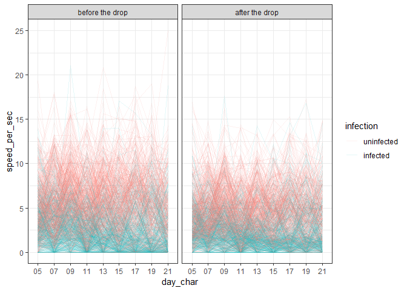<!-- -->

If we calculate the variance for infected and uninfected copepods over
the experiment, we see that infecteds have consistently lower variance.
This is not surprising. Power laws imply that lower activity should be
associated with lower variance in
activity.

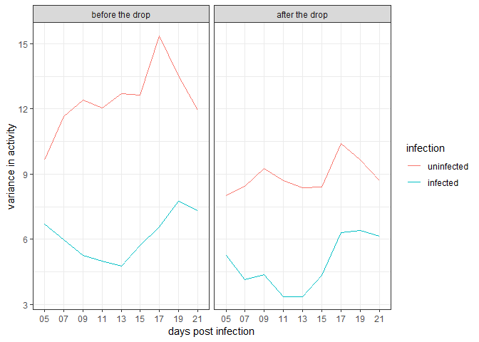<!-- -->

Here is that power-law relationsip: more activity, more variance.
Importantly, the relationship looks the same for infected and uninfected
copepods. Infected copepods exhibit lower behavioral variance, but not
lower than we would
expect.

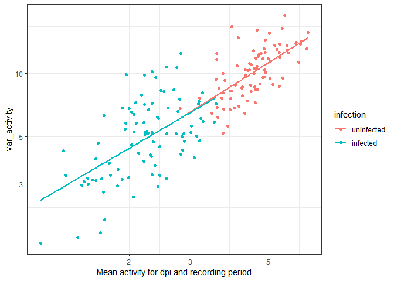<!-- -->

Is variance genotype dependent? For both host and parasite genotypes, it
looks like the same jumbled pattern we saw with mean activity
levels.

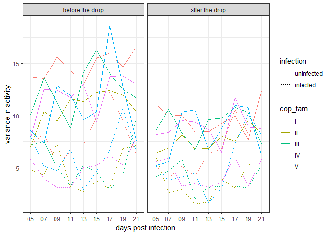<!-- -->

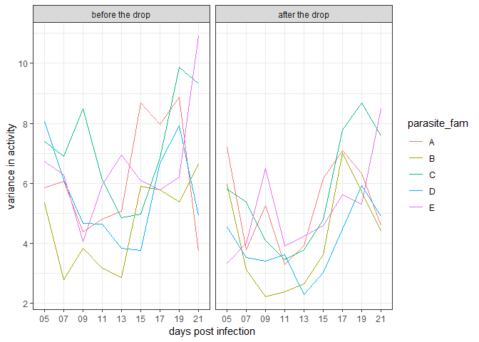<!-- -->

Thus, variance in behavior is not independent from the mean, and as such
it does not look like infected copepods exhibit more (or less) variation
in their behavior than we would expect. Moreover, the reduced variance
in infected copepods probably explains the differences in the effect
sizes (changes in R2) between infected-only models and
infected-and-uninfected models.

# Model summaries

Now we have done plenty of modelling. Let’s summarize these model
comparisons in one place for future reference (manuscript table).

### Uninfected and infected models

We re-make the model comparisons using the full dataset (both uninfected
and infected copepods), starting with establishing the initial ‘base’
model.

    ## Data: bdr
    ## Models:
    ## lmu_int: speed_per_sec ~ 1 + (1 | cop_name)
    ## lmu0: speed_per_sec ~ (1 | cop_name) + box + rec_time + day_char
    ## lmu01: speed_per_sec ~ (1 | cop_name) + box + rec_time + day_char + 
    ## lmu01:     rec_time:day_char
    ##         Df   AIC   BIC logLik deviance   Chisq Chi Df Pr(>Chisq)    
    ## lmu_int  3 79845 79868 -39919    79839                              
    ## lmu0    14 79344 79452 -39658    79316 522.788     11  < 2.2e-16 ***
    ## lmu01   22 79329 79499 -39643    79285  30.711      8  0.0001582 ***
    ## ---
    ## Signif. codes:  0 '***' 0.001 '**' 0.01 '*' 0.05 '.' 0.1 ' ' 1

Then, we assess the role of infection.

    ## Data: bdr
    ## Models:
    ## lmu01: speed_per_sec ~ (1 | cop_name) + box + rec_time + day_char + 
    ## lmu01:     rec_time:day_char
    ## lmu1: speed_per_sec ~ (1 | cop_name) + box + rec_time + day_char + 
    ## lmu1:     infection + rec_time:day_char
    ## lmu11: speed_per_sec ~ (1 | cop_name) + box + rec_time + day_char + 
    ## lmu11:     infection + rec_time:day_char + rec_time:infection
    ## lmu12: speed_per_sec ~ (1 | cop_name) + box + rec_time + day_char + 
    ## lmu12:     infection + rec_time:day_char + rec_time:infection + day_char:infection
    ## lmu13: speed_per_sec ~ (1 | cop_name) + box + rec_time + day_char + 
    ## lmu13:     infection + rec_time:day_char + rec_time:infection + day_char:infection + 
    ## lmu13:     rec_time:day_char:infection
    ##       Df   AIC   BIC logLik deviance   Chisq Chi Df Pr(>Chisq)    
    ## lmu01 22 79329 79499 -39643    79285                              
    ## lmu1  23 78970 79147 -39462    78924 361.226      1  < 2.2e-16 ***
    ## lmu11 24 78909 79094 -39430    78861  63.312      1  1.765e-15 ***
    ## lmu12 32 78761 79008 -39349    78697 163.308      8  < 2.2e-16 ***
    ## lmu13 40 78766 79074 -39343    78686  11.576      8     0.1711    
    ## ---
    ## Signif. codes:  0 '***' 0.001 '**' 0.01 '*' 0.05 '.' 0.1 ' ' 1

Next, we examine copepod genotype effects, and then…

    ## Data: bdr
    ## Models:
    ## lmu12: speed_per_sec ~ (1 | cop_name) + box + rec_time + day_char + 
    ## lmu12:     infection + rec_time:day_char + rec_time:infection + day_char:infection
    ## lmu2: speed_per_sec ~ (1 | cop_name) + box + rec_time + day_char + 
    ## lmu2:     infection + cop_fam + rec_time:day_char + rec_time:infection + 
    ## lmu2:     day_char:infection
    ## lmu21: speed_per_sec ~ (1 | cop_name) + box + rec_time + day_char + 
    ## lmu21:     infection + cop_fam + rec_time:day_char + rec_time:infection + 
    ## lmu21:     day_char:infection + infection:cop_fam
    ## lmu22: speed_per_sec ~ (1 | cop_name) + box + rec_time + day_char + 
    ## lmu22:     infection + cop_fam + rec_time:day_char + rec_time:infection + 
    ## lmu22:     day_char:infection + infection:cop_fam + rec_time:cop_fam + 
    ## lmu22:     rec_time:infection:cop_fam
    ##       Df   AIC   BIC logLik deviance   Chisq Chi Df Pr(>Chisq)    
    ## lmu12 32 78761 79008 -39349    78697                              
    ## lmu2  36 78736 79014 -39332    78664 32.9544      4   1.22e-06 ***
    ## lmu21 40 78737 79046 -39329    78657  6.9958      4     0.1361    
    ## lmu22 48 78741 79111 -39322    78645 12.4147      8     0.1336    
    ## ---
    ## Signif. codes:  0 '***' 0.001 '**' 0.01 '*' 0.05 '.' 0.1 ' ' 1

…parasite genotype effects.

    ## Data: bdr
    ## Models:
    ## lmu21: speed_per_sec ~ (1 | cop_name) + box + rec_time + day_char + 
    ## lmu21:     infection + cop_fam + rec_time:day_char + rec_time:infection + 
    ## lmu21:     day_char:infection + infection:cop_fam
    ## lmu3: speed_per_sec ~ (1 | cop_name) + box + rec_time + day_char + 
    ## lmu3:     infection + cop_fam + parasite_fam2 + rec_time:day_char + 
    ## lmu3:     rec_time:infection + day_char:infection + infection:cop_fam
    ## lmu31: speed_per_sec ~ (1 | cop_name) + box + rec_time + day_char + 
    ## lmu31:     infection + cop_fam + parasite_fam2 + rec_time:day_char + 
    ## lmu31:     rec_time:infection + day_char:infection + infection:cop_fam + 
    ## lmu31:     rec_time:parasite_fam2
    ##       Df   AIC   BIC logLik deviance   Chisq Chi Df Pr(>Chisq)    
    ## lmu21 40 78737 79046 -39329    78657                              
    ## lmu3  44 78720 79060 -39316    78632 25.3594      4   4.26e-05 ***
    ## lmu31 48 78725 79095 -39314    78629  3.3123      4      0.507    
    ## ---
    ## Signif. codes:  0 '***' 0.001 '**' 0.01 '*' 0.05 '.' 0.1 ' ' 1

Finally, we examine the interaction between host and parasite genotype.

    ## Data: bdr
    ## Models:
    ## lmu3: speed_per_sec ~ (1 | cop_name) + box + rec_time + day_char + 
    ## lmu3:     infection + cop_fam + parasite_fam2 + rec_time:day_char + 
    ## lmu3:     rec_time:infection + day_char:infection + infection:cop_fam
    ## lmu4: speed_per_sec ~ (1 | cop_name) + box + rec_time + day_char + 
    ## lmu4:     infection + cop_fam + parasite_fam2 + rec_time:day_char + 
    ## lmu4:     rec_time:infection + day_char:infection + infection:cop_fam + 
    ## lmu4:     infection:parasite_fam2 + cop_fam:parasite_fam2 + infection:cop_fam:parasite_fam2
    ## lmu41: speed_per_sec ~ (1 | cop_name) + box + rec_time + day_char + 
    ## lmu41:     infection + cop_fam + parasite_fam2 + rec_time:day_char + 
    ## lmu41:     rec_time:infection + day_char:infection + infection:cop_fam + 
    ## lmu41:     infection:parasite_fam2 + cop_fam:parasite_fam2 + infection:cop_fam:parasite_fam2 + 
    ## lmu41:     day_char:infection:cop_fam:parasite_fam2
    ##        Df   AIC   BIC logLik deviance   Chisq Chi Df Pr(>Chisq)    
    ## lmu3   44 78720 79060 -39316    78632                              
    ## lmu4   60 78737 79200 -39308    78617  15.134     16     0.5149    
    ## lmu41 284 78607 80798 -39019    78039 578.324    224     <2e-16 ***
    ## ---
    ## Signif. codes:  0 '***' 0.001 '**' 0.01 '*' 0.05 '.' 0.1 ' ' 1

Here are some measures of model fit, R2 for all these models.

    ## # A tibble: 14 x 3
    ##       df marg_r2 cond_r2
    ##    <dbl>   <dbl>   <dbl>
    ##  1     0   0       0.379
    ##  2    11   0.037   0.398
    ##  3    19   0.038   0.399
    ##  4    20   0.159   0.398
    ##  5    21   0.161   0.4  
    ##  6    29   0.168   0.407
    ##  7    37   0.168   0.407
    ##  8    33   0.176   0.408
    ##  9    37   0.178   0.408
    ## 10    45   0.178   0.409
    ## 11    41   0.184   0.409
    ## 12    45   0.184   0.409
    ## 13    57   0.188   0.412
    ## 14   281   0.206   0.43

### Just infecteds

Now we take the same approach with just infecteds. First establish a
base model.

    ## Data: filter(bdr, trt == "infected")
    ## Models:
    ## lm_int: speed_per_sec ~ 1 + (1 | cop_name)
    ## lm0: speed_per_sec ~ (1 | cop_name) + box + rec_time + day_char
    ## lm01: speed_per_sec ~ (1 | cop_name) + box + rec_time + day_char + 
    ## lm01:     rec_time:day_char
    ##        Df   AIC   BIC logLik deviance   Chisq Chi Df Pr(>Chisq)    
    ## lm_int  3 30076 30096 -15035    30070                              
    ## lm0    14 29865 29960 -14918    29837 233.133     11  < 2.2e-16 ***
    ## lm01   22 29853 30003 -14904    29809  27.987      8  0.0004767 ***
    ## ---
    ## Signif. codes:  0 '***' 0.001 '**' 0.01 '*' 0.05 '.' 0.1 ' ' 1

Then, check copepod genotype effects, and also…

    ## Data: filter(bdr, trt == "infected")
    ## Models:
    ## lm01: speed_per_sec ~ (1 | cop_name) + box + rec_time + day_char + 
    ## lm01:     rec_time:day_char
    ## lm2: speed_per_sec ~ (1 | cop_name) + box + rec_time + day_char + 
    ## lm2:     cop_fam + rec_time:day_char
    ## lm21: speed_per_sec ~ (1 | cop_name) + box + rec_time + day_char + 
    ## lm21:     cop_fam + rec_time:day_char + rec_time:cop_fam
    ##      Df   AIC   BIC logLik deviance   Chisq Chi Df Pr(>Chisq)  
    ## lm01 22 29853 30003 -14904    29809                            
    ## lm2  26 29849 30027 -14899    29797 11.4346      4    0.02209 *
    ## lm21 30 29853 30058 -14896    29793  4.3345      4    0.36262  
    ## ---
    ## Signif. codes:  0 '***' 0.001 '**' 0.01 '*' 0.05 '.' 0.1 ' ' 1

…worm genotype effects….

    ## Data: filter(bdr, trt == "infected")
    ## Models:
    ## lm2: speed_per_sec ~ (1 | cop_name) + box + rec_time + day_char + 
    ## lm2:     cop_fam + rec_time:day_char
    ## lm3: speed_per_sec ~ (1 | cop_name) + box + rec_time + day_char + 
    ## lm3:     cop_fam + parasite_fam + rec_time:day_char
    ## lm31: speed_per_sec ~ (1 | cop_name) + box + rec_time + day_char + 
    ## lm31:     cop_fam + parasite_fam + rec_time:day_char + rec_time:parasite_fam
    ##      Df   AIC   BIC logLik deviance   Chisq Chi Df Pr(>Chisq)    
    ## lm2  26 29849 30027 -14899    29797                              
    ## lm3  30 29828 30033 -14884    29768 29.0626      4  7.592e-06 ***
    ## lm31 34 29831 30064 -14882    29763  4.8213      4     0.3061    
    ## ---
    ## Signif. codes:  0 '***' 0.001 '**' 0.01 '*' 0.05 '.' 0.1 ' ' 1

…and finally genotype x genotype interactions.

    ## Data: filter(bdr, trt == "infected")
    ## Models:
    ## lm3: speed_per_sec ~ (1 | cop_name) + box + rec_time + day_char + 
    ## lm3:     cop_fam + parasite_fam + rec_time:day_char
    ## lm4: speed_per_sec ~ (1 | cop_name) + box + rec_time + day_char + 
    ## lm4:     cop_fam + parasite_fam + rec_time:day_char + cop_fam:parasite_fam
    ## lm41: speed_per_sec ~ (1 | cop_name) + box + rec_time + day_char + 
    ## lm41:     cop_fam + parasite_fam + rec_time:day_char + cop_fam:parasite_fam + 
    ## lm41:     day_char:parasite_fam + day_char:cop_fam + day_char:cop_fam:parasite_fam
    ##       Df   AIC   BIC logLik deviance   Chisq Chi Df Pr(>Chisq)    
    ## lm3   30 29828 30033 -14884    29768                              
    ## lm4   46 29832 30146 -14870    29740  28.535     16    0.02727 *  
    ## lm41 238 29737 31362 -14630    29261 478.735    192    < 2e-16 ***
    ## ---
    ## Signif. codes:  0 '***' 0.001 '**' 0.01 '*' 0.05 '.' 0.1 ' ' 1

Here are the R2 values for these models.

    ## # A tibble: 9 x 3
    ##      df marg_r2 cond_r2
    ##   <dbl>   <dbl>   <dbl>
    ## 1     0   0       0.242
    ## 2    11   0.032   0.264
    ## 3    19   0.035   0.266
    ## 4    23   0.042   0.269
    ## 5    27   0.042   0.269
    ## 6    27   0.06    0.27 
    ## 7    31   0.061   0.27 
    ## 8    43   0.077   0.278
    ## 9   235   0.124   0.323

# Other fitness proxies

In the experiment, we measured three other worm traits: infection rate,
worm development, and worm growth. In each of these traits, we can look
for host x parasite genotype interactions and then examine whether
manipulation was correlated with any of these traits.

### Infection

To determine what factors affect copepod infection, we fit a series of
GLM models with a binomial error distribution. Both host and parasite
genotypes significantly affected infection rate, but their interaction
did not.

    ## Analysis of Deviance Table
    ## 
    ## Model 1: infected ~ 1
    ## Model 2: infected ~ factor(box)
    ## Model 3: infected ~ factor(box) + cop_fam
    ## Model 4: infected ~ factor(box) + cop_fam + parasite_fam
    ## Model 5: infected ~ factor(box) + cop_fam + parasite_fam + cop_fam:parasite_fam
    ##   Resid. Df Resid. Dev Df Deviance Pr(>Chi)   
    ## 1      1501     1776.4                        
    ## 2      1499     1773.5  2   2.8438 0.241254   
    ## 3      1495     1760.2  4  13.3307 0.009768 **
    ## 4      1491     1747.7  4  12.5319 0.013805 * 
    ## 5      1475     1732.7 16  14.9669 0.527067   
    ## ---
    ## Signif. codes:  0 '***' 0.001 '**' 0.01 '*' 0.05 '.' 0.1 ' ' 1

These main effects can be seen here. There is variation along the x
(copepod genotype) and y (parasite genotype), but comparatively little
line crossing, which would indicate
interactions.

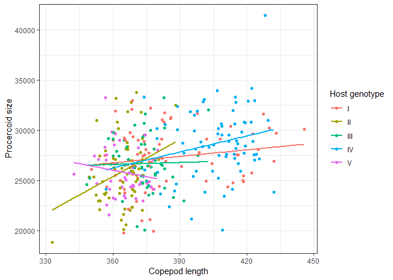<!-- -->

### Copepod survival

We can check whether host genotype, parasite genotype or both affected
copepod survival. When we fit a series of GLM models on survival
probability (whether or not copepods survived until the end of the
experiment, not how long they survived), we find several significant
effects. Survival varied across experimental blocks, infected copepods
were more likely to survive than uninfected copepods, and survival
varied with copepod genotype.

    ## Analysis of Deviance Table
    ## 
    ## Model 1: dead ~ 1
    ## Model 2: dead ~ factor(box)
    ## Model 3: dead ~ factor(box) + infection
    ## Model 4: dead ~ factor(box) + infection + cop_fam
    ## Model 5: dead ~ factor(box) + infection + cop_fam + infection:cop_fam
    ## Model 6: dead ~ factor(box) + infection + cop_fam + parasite_fam2 + infection:cop_fam
    ## Model 7: dead ~ factor(box) + infection + cop_fam + parasite_fam2 + infection:cop_fam + 
    ##     cop_fam:parasite_fam2
    ##   Resid. Df Resid. Dev Df Deviance  Pr(>Chi)    
    ## 1      1635     2014.1                          
    ## 2      1633     1991.6  2   22.481 1.313e-05 ***
    ## 3      1632     1971.1  1   20.484 6.014e-06 ***
    ## 4      1628     1850.4  4  120.693 < 2.2e-16 ***
    ## 5      1624     1844.2  4    6.226    0.1829    
    ## 6      1620     1843.8  4    0.440    0.9791    
    ## 7      1604     1821.7 16   22.097    0.1401    
    ## ---
    ## Signif. codes:  0 '***' 0.001 '**' 0.01 '*' 0.05 '.' 0.1 ' ' 1

    ## # A tibble: 2 x 5
    ##   infection  deads     n prop_surv prop_dead
    ##   <chr>      <int> <int>     <dbl>     <dbl>
    ## 1 infected      91   418     0.782     0.218
    ## 2 uninfected   409  1218     0.664     0.336

The effect of copepod genotype was not dependent on infection,
e.g. copepod line III had the lowest survival regardless of infection.
Also note how parasite genotype had little impact on infection - there
is not consistent separation of lines in the left
panel.

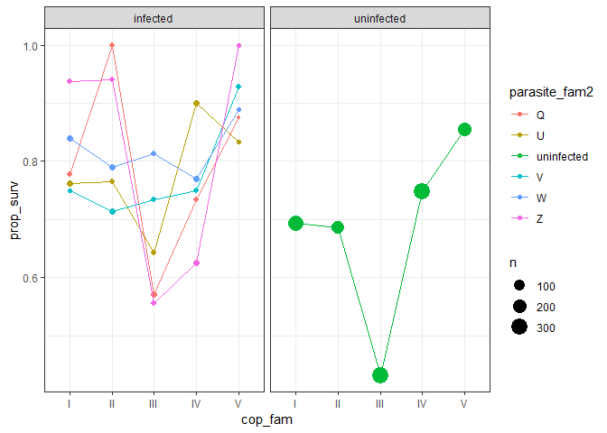<!-- -->

### Development of the cercomere

As a measure of development, we recorded whether worms had a cercomere
at 9 dpi. Worms that do can infect fish at an earlier age. Again, we
used standard binomial GLMs. These results suggested that parasite
genotype had a strong effect on worm development, but host genotype does
not.

    ## Analysis of Deviance Table
    ## 
    ## Model 1: cerc_d9 ~ 1
    ## Model 2: cerc_d9 ~ factor(box)
    ## Model 3: cerc_d9 ~ factor(box) + cop_fam
    ## Model 4: cerc_d9 ~ factor(box) + cop_fam + parasite_fam
    ## Model 5: cerc_d9 ~ factor(box) + cop_fam + parasite_fam + cop_fam:parasite_fam
    ##   Resid. Df Resid. Dev Df Deviance  Pr(>Chi)    
    ## 1       412     406.02                          
    ## 2       410     383.29  2   22.733 1.158e-05 ***
    ## 3       406     379.25  4    4.040    0.4007    
    ## 4       402     321.83  4   57.423 1.009e-11 ***
    ## 5       386     299.50 16   22.325    0.1330    
    ## ---
    ## Signif. codes:  0 '***' 0.001 '**' 0.01 '*' 0.05 '.' 0.1 ' ' 1

One worm genotype in particular developed faster than the others.
Copepod genotype had no effect on how fast worms
developed.

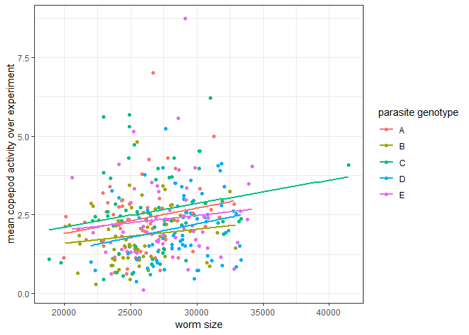<!-- -->

We can also check whether copepods harboring fast developing worms
behaved differently. The behavior of infected copepods does not seem
obviously related to worm development, though perhaps fast-developing
worms were more active at the beginning of the experiment (5 to 9
dpi).

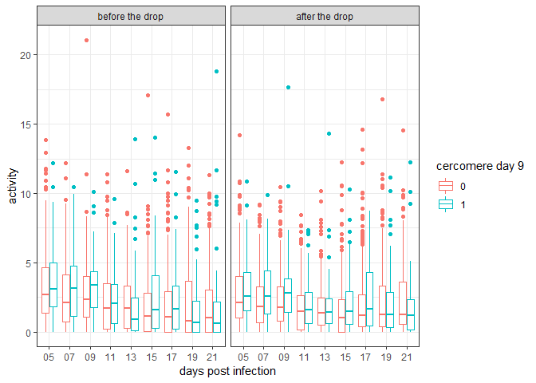<!-- -->

To check this, we can add cercomere presence to a model. We’ll start
with the most complex model, the one including time-dependent genotype
effects. This is expected to be conservative, because some variation
explained by worm development could also be explained by worm genotype
(genotype affected development). Adding cercomere presence to the model,
as well as it’s interaction with time, was a slight improvement.

    ## Data: filter(bdr, !is.na(cerc_d9))
    ## Models:
    ## lm_cerc0: speed_per_sec ~ box + rec_time * day_char + cop_fam * parasite_fam + 
    ## lm_cerc0:     cop_fam * day_char + parasite_fam * day_char + cop_fam * 
    ## lm_cerc0:     parasite_fam * day_char + (1 | cop_name)
    ## lm_cerc1: speed_per_sec ~ box + rec_time + day_char + cop_fam + parasite_fam + 
    ## lm_cerc1:     (1 | cop_name) + factor(cerc_d9) + rec_time:day_char + cop_fam:parasite_fam + 
    ## lm_cerc1:     day_char:cop_fam + day_char:parasite_fam + day_char:cop_fam:parasite_fam
    ## lm_cerc2: speed_per_sec ~ box + rec_time + day_char + cop_fam + parasite_fam + 
    ## lm_cerc2:     (1 | cop_name) + factor(cerc_d9) + rec_time:day_char + cop_fam:parasite_fam + 
    ## lm_cerc2:     day_char:cop_fam + day_char:parasite_fam + day_char:factor(cerc_d9) + 
    ## lm_cerc2:     day_char:cop_fam:parasite_fam
    ##           Df   AIC   BIC logLik deviance   Chisq Chi Df Pr(>Chisq)  
    ## lm_cerc0 238 29596 31221 -14560    29120                            
    ## lm_cerc1 239 29593 31224 -14558    29115  5.2097      1    0.02246 *
    ## lm_cerc2 247 29593 31279 -14550    29099 15.8149      8    0.04511 *
    ## ---
    ## Signif. codes:  0 '***' 0.001 '**' 0.01 '*' 0.05 '.' 0.1 ' ' 1

Adding cercomere to the full model only explains about 0.3% of the
variation in infected copepod behavior.

    ## # A tibble: 2 x 4
    ##   step                     df marg_r2 cond_r2
    ##   <chr>                 <dbl>   <dbl>   <dbl>
    ## 1 full model              235   0.126   0.325
    ## 2 add cercomer presence   244   0.129   0.326

The effect is weak, but it is in the direction consistent with a
trade-off. Faster development is associated with lower manipulation
(less difference to uninfecteds). That is consistent with other
studies.

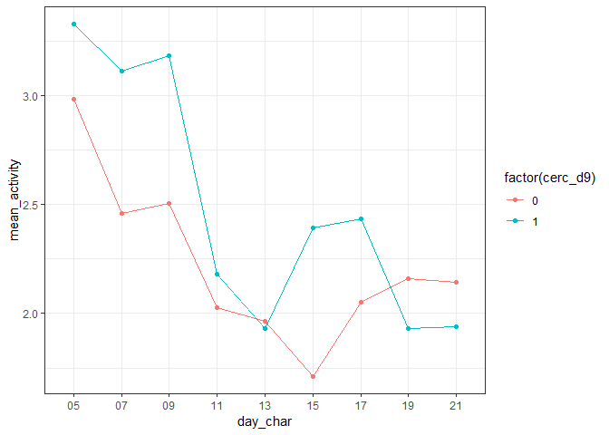<!-- -->

### Procercoid size

At the end of the experiment, we dissected infected copepods and
measured copepod length and worm size. Larger worms have a higher
probability to infect the next host, a fish. We fit the same series of
models, except now we are using standard GLMs with a Gaussian error
distribution. Also, we included copepod length as a covariate, which we
measured when recording worm size.

Two things significantly improved the model: worms are larger in larger
copepods and parasite genotypes differ in their growth.

    ## Analysis of Deviance Table
    ## 
    ## Model 1: proc_size/1000 ~ 1
    ## Model 2: proc_size/1000 ~ factor(box)
    ## Model 3: proc_size/1000 ~ factor(box) + cop_fam
    ## Model 4: proc_size/1000 ~ factor(box) + cop_fam + cop_length
    ## Model 5: proc_size/1000 ~ factor(box) + cop_fam + cop_length + parasite_fam
    ## Model 6: proc_size/1000 ~ factor(box) + cop_fam + cop_length + parasite_fam + 
    ##     cop_fam:parasite_fam
    ##   Resid. Df Resid. Dev Df Deviance  Pr(>Chi)    
    ## 1       315     3256.1                          
    ## 2       313     3218.4  2    37.73 0.0891576 .  
    ## 3       309     2887.9  4   330.45 1.417e-08 ***
    ## 4       308     2802.8  1    85.15 0.0009564 ***
    ## 5       304     2335.4  4   467.38 3.065e-12 ***
    ## 6       288     2247.7 16    87.70 0.7946194    
    ## ---
    ## Signif. codes:  0 '***' 0.001 '**' 0.01 '*' 0.05 '.' 0.1 ' ' 1

Host genotype did not have an effect, though this is slightly
misleading, because some host genotypes tended to be larger than others.
Although copepod length and copepod genotype are confounded, length
seems to better explain parasite growth than copepod genotype. That is,
host genotype effect does not seem to have an effect beyond that of
copepod
length.

<!-- -->

Parasite genotype, by contrast, had a clear effect on worm
size.

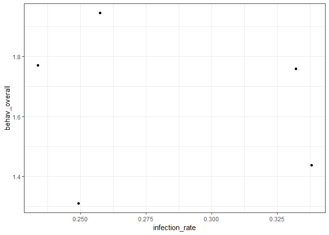<!-- -->

Parasite growth was not determined by genotype x genotype
interactions.

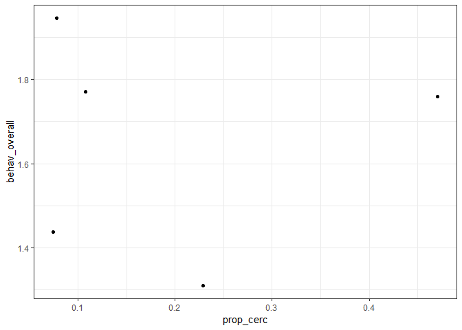<!-- -->

To explore whether worm growth is related to copepod behavior, I added
worm size to the full model. Again, there is overlap among predictors,
since parasite genotype also affects worm size. Thus, this step is
checking whether parasite growth explains additional variation in
copepod behavior, beyond that explained by genotype, and it does.
However, this effect is not time-dependent.

    ## Data: filter(bdr, !is.na(proc_size))
    ## Models:
    ## lm_proc0: speed_per_sec ~ box + rec_time * day_char + cop_fam * parasite_fam + 
    ## lm_proc0:     cop_fam * day_char + parasite_fam * day_char + cop_fam * 
    ## lm_proc0:     parasite_fam * day_char + (1 | cop_name)
    ## lm_proc1: speed_per_sec ~ box + rec_time + day_char + cop_fam + parasite_fam + 
    ## lm_proc1:     (1 | cop_name) + proc2 + rec_time:day_char + cop_fam:parasite_fam + 
    ## lm_proc1:     day_char:cop_fam + day_char:parasite_fam + day_char:cop_fam:parasite_fam
    ## lm_proc2: speed_per_sec ~ box + rec_time + day_char + cop_fam + parasite_fam + 
    ## lm_proc2:     (1 | cop_name) + proc2 + rec_time:day_char + cop_fam:parasite_fam + 
    ## lm_proc2:     day_char:cop_fam + day_char:parasite_fam + day_char:proc2 + 
    ## lm_proc2:     day_char:cop_fam:parasite_fam
    ##           Df   AIC   BIC logLik deviance   Chisq Chi Df Pr(>Chisq)    
    ## lm_proc0 238 24827 26411 -12176    24351                              
    ## lm_proc1 239 24816 26406 -12169    24338 13.3310      1  0.0002611 ***
    ## lm_proc2 247 24823 26467 -12165    24329  8.4377      8  0.3919243    
    ## ---
    ## Signif. codes:  0 '***' 0.001 '**' 0.01 '*' 0.05 '.' 0.1 ' ' 1

The effect is relatively strong, explaining about 1% of the variation.

    ## # A tibble: 2 x 4
    ##   step             df marg_r2 cond_r2
    ##   <chr>         <dbl>   <dbl>   <dbl>
    ## 1 full model      235   0.126   0.309
    ## 2 add worm size   236   0.134   0.309

Worms grow larger in more active copepods. Neatly, the effects of
parasite genotype and parasite size are not confounded. Some genotypes
are more active than others, regardless of how large the worms
grow.

<!-- -->

Elevated copepod activity was associated with both faster parasite
development and larger parasite size. Are these effects are independent?
Since procercoid size had the larger effect, we first add procercoid
size to a full model, and then we add cercomer presence to see if it
explains additional variation. The result is significant.

    ## Data: filter(bdr, !is.na(proc_size), !is.na(cerc_d9))
    ## Models:
    ## lm_proc0: speed_per_sec ~ box + rec_time * day_char + cop_fam * parasite_fam + 
    ## lm_proc0:     cop_fam * day_char + parasite_fam * day_char + cop_fam * 
    ## lm_proc0:     parasite_fam * day_char + (1 | cop_name)
    ## lm_proc1: speed_per_sec ~ box + rec_time + day_char + cop_fam + parasite_fam + 
    ## lm_proc1:     (1 | cop_name) + proc2 + rec_time:day_char + cop_fam:parasite_fam + 
    ## lm_proc1:     day_char:cop_fam + day_char:parasite_fam + day_char:cop_fam:parasite_fam
    ## lm_proc2: speed_per_sec ~ box + rec_time + day_char + cop_fam + parasite_fam + 
    ## lm_proc2:     (1 | cop_name) + proc2 + factor(cerc_d9) + rec_time:day_char + 
    ## lm_proc2:     cop_fam:parasite_fam + day_char:cop_fam + day_char:parasite_fam + 
    ## lm_proc2:     day_char:factor(cerc_d9) + day_char:cop_fam:parasite_fam
    ##           Df   AIC   BIC logLik deviance  Chisq Chi Df Pr(>Chisq)    
    ## lm_proc0 238 24749 26332 -12136    24273                             
    ## lm_proc1 239 24738 26327 -12130    24260 13.277      1  0.0002686 ***
    ## lm_proc2 248 24734 26383 -12119    24238 21.918      9  0.0091419 ** 
    ## ---
    ## Signif. codes:  0 '***' 0.001 '**' 0.01 '*' 0.05 '.' 0.1 ' ' 1

Thus, infected copepods tend to be more active (less manipulated) when
they have faster-developing and larger-growing worms, though the effect
of development appears on some days and not
others.

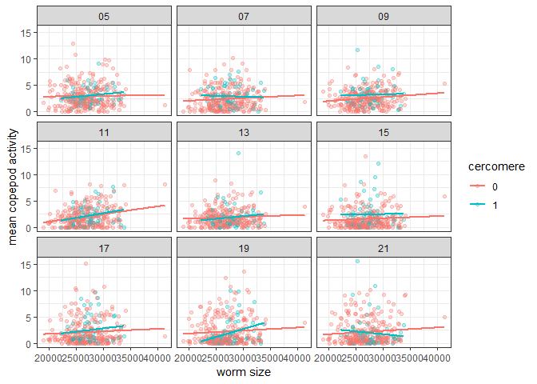<!-- -->

### Genetic correlations

The above analyses looked at how parasite traits (growth and
development) were related to copepod behavior, beyond the variance
attributed to genotype. In other words, they are looking at relationship
after accounting for genetics and are thus not explicitly genetic
relationships. If genotypes that have high values for say behavior also
have high values for growth, then these traits are genetically
correlated, which is usually assumed to be due to pleiotropy.

#### Parasite genotypes

For the three parasite traits, we calculated the averages for each
genotype. For behavior, we calculate mean activity overall, as well as
during the three developmental phases of the experiment, when worms are
uninfective, partially infective, and mature.

Here is the correlation matrix between the different variables (Spearman
correlations).

    ##                behav_overall behav_early behav_mid behav_late
    ## behav_overall            1.0         0.7       1.0        0.9
    ## behav_early              0.7         1.0       0.7        0.6
    ## behav_mid                1.0         0.7       1.0        0.9
    ## behav_late               0.9         0.6       0.9        1.0
    ## infection_rate          -0.2        -0.3      -0.2        0.1
    ## prop_cerc               -0.2         0.2      -0.2        0.0
    ## proc_size_avg            0.1         0.1       0.1        0.3
    ##                infection_rate prop_cerc proc_size_avg
    ## behav_overall            -0.2      -0.2           0.1
    ## behav_early              -0.3       0.2           0.1
    ## behav_mid                -0.2      -0.2           0.1
    ## behav_late                0.1       0.0           0.3
    ## infection_rate            1.0      -0.3           0.9
    ## prop_cerc                -0.3       1.0          -0.4
    ## proc_size_avg             0.9      -0.4           1.0

The correlations among behavior variables were all positive, consistent
with parasite genotypes retaining their ranks over time. The
correlations between behavior variables and the other three traits were
low and inconsistent (negative for infection and development, positive
for size). Here are what those relationships look
like.

<!-- -->
<!-- -->

<!-- -->

In these three plots, there is nothing suggestive of a genetic
correlation between behavior and other fitness proxies.

Finally, among the three non-behavior fitness proxies, one correlation
was strongly positive. Parasite families that had high infection rates
also grew to a large size. This genetic correlation has been observed in
previous studies (Hammerschmidt and Kurtz 2005, Benesh
2010).

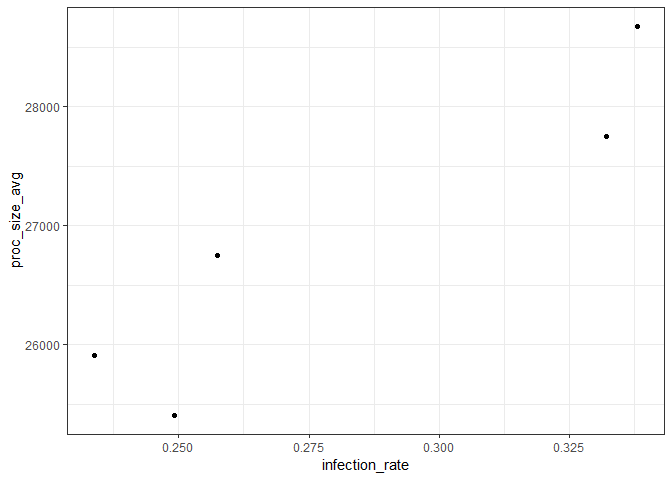<!-- -->

#### Host genotypes

We can take the same approach with host traits. Copepod genotype
affected both infection probability and behavior. But did it infect it
in the same way? Are there genetic correlations?

For each copepod genotype, I calculated its infection rate, survival
(both when infected and uninfected), length, and behavior. I did not
separate behavior by infection, since copepod genotypes behaved
similarly, regardless of infection.

Like for parasite genotypes, behavioral correlations were consistently
positive, though the correlation between behavior at the beginning and
end of the experiment was weak, consistent with the time-dependent
genotype effects we saw in our modelling.

    ##                 behav_overall behav_early behav_mid behav_late
    ## behav_overall             1.0         0.5       0.9        0.8
    ## behav_early               0.5         1.0       0.8        0.1
    ## behav_mid                 0.9         0.8       1.0        0.5
    ## behav_late                0.8         0.1       0.5        1.0
    ## infection_rate           -0.9        -0.3      -0.8       -0.6
    ## prop_surv_uninf           0.4         0.3       0.3        0.6
    ## prop_surv_inf             0.0         0.5       0.1        0.2
    ## cop_length                0.1        -0.3       0.0        0.0
    ##                 infection_rate prop_surv_uninf prop_surv_inf cop_length
    ## behav_overall             -0.9             0.4           0.0        0.1
    ## behav_early               -0.3             0.3           0.5       -0.3
    ## behav_mid                 -0.8             0.3           0.1        0.0
    ## behav_late                -0.6             0.6           0.2        0.0
    ## infection_rate             1.0             0.0           0.4       -0.2
    ## prop_surv_uninf            0.0             1.0           0.6        0.2
    ## prop_surv_inf              0.4             0.6           1.0       -0.6
    ## cop_length                -0.2             0.2          -0.6        1.0

The largest correlation between a behavior and non-behavior variable was
for infection rate. More active genotypes had lower infection
rates.

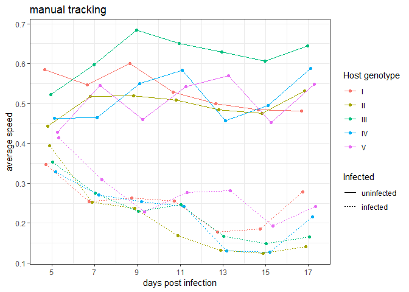<!-- -->

Among the non-behavior traits, survival rate when infected and
uninfected was positively correlated, suggesting genetic effects on
survival are not dependent on
infection.

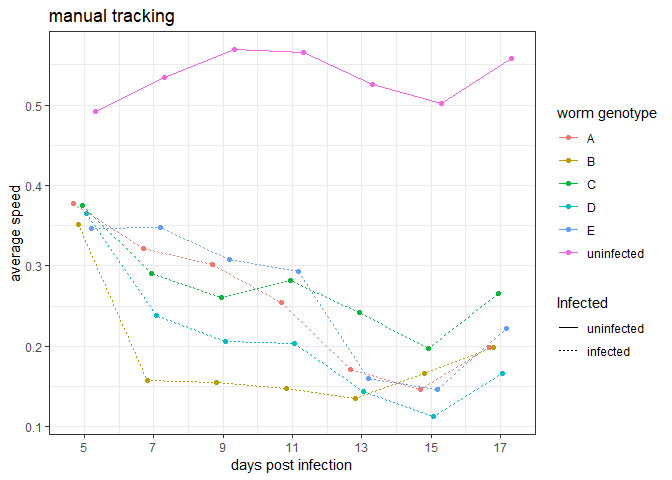<!-- -->

These genetic correlations need to be read with caution, as they are
based on just 5 data points and we are averaging over substantial
variation, such as that between days. However, some patterns are
consistent with previous analyses.

I am reluctant to extend this approach to genotype combinations, i.e. to
see if trait correlations depend on both host and parasite genotype
together. That is because genotype x genotype interactions appear weak;
they were not significant for parasite infection, development, or
growth. However, it may be useful for examining the biological
significance of genotype x genotype x time interactions. That is, are
certain genotype combinations that are more active at a certain time
also involve more developed worms?

#### Trait correlations across genotype combinations

    ##                behav_overall behav_early behav_mid behav_late
    ## behav_overall          1.000       0.772     0.724      0.717
    ## behav_early            0.772       1.000     0.325      0.337
    ## behav_mid              0.724       0.325     1.000      0.547
    ## behav_late             0.717       0.337     0.547      1.000
    ## infection_rate         0.009       0.303    -0.217     -0.073
    ## prop_cerc             -0.014       0.066    -0.128     -0.183
    ## proc_size_avg          0.068      -0.016     0.083      0.042
    ## prop_surv_inf          0.063       0.166     0.098     -0.069
    ##                infection_rate prop_cerc proc_size_avg prop_surv_inf
    ## behav_overall           0.009    -0.014         0.068         0.063
    ## behav_early             0.303     0.066        -0.016         0.166
    ## behav_mid              -0.217    -0.128         0.083         0.098
    ## behav_late             -0.073    -0.183         0.042        -0.069
    ## infection_rate          1.000     0.181         0.178         0.340
    ## prop_cerc               0.181     1.000        -0.114         0.025
    ## proc_size_avg           0.178    -0.114         1.000        -0.112
    ## prop_surv_inf           0.340     0.025        -0.112         1.000

    ## 
    ##  Spearman's rank correlation rho
    ## 
    ## data:  bdr_avg$behav_early and bdr_avg$behav_late
    ## S = 1724, p-value = 0.09998
    ## alternative hypothesis: true rho is not equal to 0
    ## sample estimates:
    ##       rho 
    ## 0.3369231

    ## 
    ##  Spearman's rank correlation rho
    ## 
    ## data:  bdr_avg$behav_early and bdr_avg$prop_cerc
    ## S = 2428.6, p-value = 0.7542
    ## alternative hypothesis: true rho is not equal to 0
    ## sample estimates:
    ##        rho 
    ## 0.06593427

    ## 
    ##  Spearman's rank correlation rho
    ## 
    ## data:  bdr_avg$behav_late and bdr_avg$prop_cerc
    ## S = 3076.2, p-value = 0.3809
    ## alternative hypothesis: true rho is not equal to 0
    ## sample estimates:
    ##        rho 
    ## -0.1831508

    ## 
    ##  Spearman's rank correlation rho
    ## 
    ## data:  bdr_avg$behav_overall and bdr_avg$prop_cerc
    ## S = 2636.1, p-value = 0.9475
    ## alternative hypothesis: true rho is not equal to 0
    ## sample estimates:
    ##        rho 
    ## -0.0138809

# Check robustness of results

We would like to be certain that our results are robust. Thus, we next
check whether the models return qualitatively under two conditions: 1)
when excluding dead copepods, and 2) when running the same models on the
smaller, manually-tracked dataset.

### Rerun excluding dead

We excluded dead copepods from the data, essentially ignoring their
behavior before dying, and then re-fit the series of models we used
previously. The results are mostly consistent. Infection, copepod
genotype, parasite genotype, and time-dependent genotype x genotype
interactions were all significant. One difference is that allowing the
copepod genotype effect to differ between infected and uninfected
copepods was marginally significant now, while it was not previously.

    ## Data: filter(bdr, dead == 0)
    ## Models:
    ## d_int: speed_per_sec ~ 1 + (1 | cop_name)
    ## d0: speed_per_sec ~ (1 | cop_name) + box + rec_time + day_char + 
    ## d0:     rec_time:day_char
    ## d1: speed_per_sec ~ (1 | cop_name) + box + rec_time + day_char + 
    ## d1:     infection + rec_time:day_char + rec_time:infection + day_char:infection
    ## d2: speed_per_sec ~ (1 | cop_name) + box + rec_time + day_char + 
    ## d2:     infection + cop_fam + rec_time:day_char + rec_time:infection + 
    ## d2:     day_char:infection
    ## d3: speed_per_sec ~ (1 | cop_name) + box + rec_time + day_char + 
    ## d3:     infection + cop_fam + rec_time:day_char + rec_time:infection + 
    ## d3:     day_char:infection + infection:cop_fam
    ## d4: speed_per_sec ~ (1 | cop_name) + box + rec_time + day_char + 
    ## d4:     infection + cop_fam + parasite_fam2 + rec_time:day_char + 
    ## d4:     rec_time:infection + day_char:infection + infection:cop_fam
    ## d5: speed_per_sec ~ (1 | cop_name) + box + rec_time + day_char + 
    ## d5:     infection + cop_fam + parasite_fam2 + rec_time:day_char + 
    ## d5:     rec_time:infection + day_char:infection + infection:cop_fam + 
    ## d5:     infection:parasite_fam2 + cop_fam:parasite_fam2 + infection:cop_fam:parasite_fam2
    ## d6: speed_per_sec ~ (1 | cop_name) + box + rec_time + day_char + 
    ## d6:     infection + cop_fam + parasite_fam2 + rec_time:day_char + 
    ## d6:     rec_time:infection + day_char:infection + infection:cop_fam + 
    ## d6:     infection:parasite_fam2 + cop_fam:parasite_fam2 + infection:cop_fam:parasite_fam2 + 
    ## d6:     day_char:infection:cop_fam:parasite_fam2
    ##        Df   AIC   BIC logLik deviance    Chisq Chi Df Pr(>Chisq)    
    ## d_int   3 66942 66965 -33468    66936                               
    ## d0     22 66562 66728 -33259    66518 417.8714     19  < 2.2e-16 ***
    ## d1     32 66010 66251 -32973    65946 572.2705     10  < 2.2e-16 ***
    ## d2     36 66004 66275 -32966    65932  14.2417      4   0.006562 ** 
    ## d3     40 66002 66304 -32961    65922   9.6941      4   0.045908 *  
    ## d4     44 65986 66318 -32949    65898  24.0754      4  7.714e-05 ***
    ## d5     60 66004 66456 -32942    65884  13.9006     16   0.606116    
    ## d6    284 65914 68055 -32673    65346 538.3933    224  < 2.2e-16 ***
    ## ---
    ## Signif. codes:  0 '***' 0.001 '**' 0.01 '*' 0.05 '.' 0.1 ' ' 1

### Rerun basics with manual data

Until now, we have used auto-tracked data, working under the assumption
that auto and manually-tracked data would yield the same results because
they were correlated. Let’s explicitly examine this by re-fitting the
same models to the manually-tracked data. This dataset is smaller,
because fewer uninfected copepods were tracked and fewer days of
recordings were processed (no data for 19 and 21 dpi). However, the
smaller sample size may be compensated for by higher accuracy, given
that the auto-tracker was known to make mistakes (hopefully at random).

The results appear similar. Infection, host genotype, parasite genotype,
and time-dependent genotype x genotype interactions were all
significant. Allowing the copepod genotype effect to differ between
infected and uninfected copepods was marginally significant as well.

    ## Data: bd
    ## Models:
    ## d_int: speed_per_sec ~ 1 + (1 | cop_name)
    ## d0: speed_per_sec ~ (1 | cop_name) + box + rec_time + day_char + 
    ## d0:     rec_time:day_char
    ## d1: speed_per_sec ~ (1 | cop_name) + box + rec_time + day_char + 
    ## d1:     infection + rec_time:day_char + rec_time:infection + day_char:infection
    ## d2: speed_per_sec ~ (1 | cop_name) + box + rec_time + day_char + 
    ## d2:     infection + cop_fam + rec_time:day_char + rec_time:infection + 
    ## d2:     day_char:infection
    ## d3: speed_per_sec ~ (1 | cop_name) + box + rec_time + day_char + 
    ## d3:     infection + cop_fam + rec_time:day_char + rec_time:infection + 
    ## d3:     day_char:infection + infection:cop_fam
    ## d4: speed_per_sec ~ (1 | cop_name) + box + rec_time + day_char + 
    ## d4:     infection + cop_fam + parasite_fam2 + rec_time:day_char + 
    ## d4:     rec_time:infection + day_char:infection + infection:cop_fam
    ## d5: speed_per_sec ~ (1 | cop_name) + box + rec_time + day_char + 
    ## d5:     infection + cop_fam + parasite_fam2 + rec_time:day_char + 
    ## d5:     rec_time:infection + day_char:infection + infection:cop_fam + 
    ## d5:     infection:parasite_fam2 + cop_fam:parasite_fam2 + infection:cop_fam:parasite_fam2
    ## d6: speed_per_sec ~ (1 | cop_name) + box + rec_time + day_char + 
    ## d6:     infection + cop_fam + parasite_fam2 + rec_time:day_char + 
    ## d6:     rec_time:infection + day_char:infection + infection:cop_fam + 
    ## d6:     infection:parasite_fam2 + cop_fam:parasite_fam2 + infection:cop_fam:parasite_fam2 + 
    ## d6:     day_char:infection:cop_fam:parasite_fam2
    ##        Df    AIC    BIC   logLik deviance   Chisq Chi Df Pr(>Chisq)    
    ## d_int   3 3393.2 3414.5 -1693.60   3387.2                              
    ## d0     18 2987.2 3115.3 -1475.58   2951.2 436.022     15  < 2.2e-16 ***
    ## d1     26 2464.6 2649.7 -1206.30   2412.6 538.567      8  < 2.2e-16 ***
    ## d2     30 2453.5 2667.0 -1196.75   2393.5  19.100      4  0.0007512 ***
    ## d3     34 2450.3 2692.3 -1191.13   2382.3  11.235      4  0.0240438 *  
    ## d4     38 2431.7 2702.2 -1177.87   2355.7  26.530      4  2.474e-05 ***
    ## d5     54 2444.5 2828.9 -1168.25   2336.5  19.231     16  0.2568449    
    ## d6    222 2413.9 3994.1  -984.96   1969.9 366.583    168  < 2.2e-16 ***
    ## ---
    ## Signif. codes:  0 '***' 0.001 '**' 0.01 '*' 0.05 '.' 0.1 ' ' 1

However, when we plot how copepod genotype effects vary with infection,
there is not and obvious
pattern.

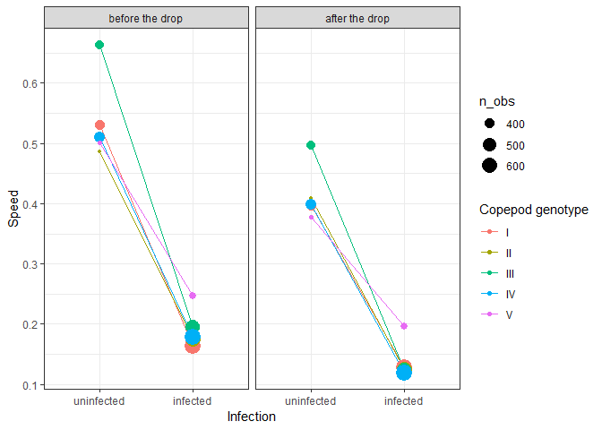<!-- -->

Let’s look at effect sizes for the manually-tracked dataset. Overall,
the total variance explained (conditional R2) was larger than
with the auto-tracked data, probably because there was less random noise
in this dataset. In general the effect sizes seem comparable.

    ## # A tibble: 8 x 5
    ##   step                           df_used marg_r2 cond_r2 cop_ind_var_expla~
    ##   <chr>                            <dbl>   <dbl>   <dbl>              <dbl>
    ## 1 intercept                           NA   0       0.412              0.412
    ## 2 base                                15   0.043   0.44               0.397
    ## 3 infection                            8   0.223   0.452              0.229
    ## 4 copepod genotype                     4   0.23    0.453              0.223
    ## 5 copepod genotype x infection         4   0.233   0.453              0.22 
    ## 6 worm genotype                        4   0.243   0.454              0.211
    ## 7 host x parasite genotype inte~      16   0.249   0.457              0.208
    ## 8 time-dependent genotype x gen~     168   0.268   0.476              0.208

We can put the effect sizes side by side in a table. Indeed, the effect
sizes are very comparable, though infection seems to have a larger
effect in the manual data. I assume this is due to the lower variation
overall in the manual data (less random noise).

    ## # A tibble: 8 x 5
    ##   step                 marg_r2_manual marg_r2_auto var_exp_man var_exp_auto
    ##   <chr>                         <dbl>        <dbl>       <dbl>        <dbl>
    ## 1 intercept                     0            0        NA           NA      
    ## 2 base                          0.043        0.038     0.043        0.038  
    ## 3 infection                     0.223        0.168     0.18         0.13   
    ## 4 copepod genotype              0.23         0.176     0.007        0.00800
    ## 5 copepod genotype x ~          0.233        0.178     0.003        0.002  
    ## 6 worm genotype                 0.243        0.184     0.01000      0.006  
    ## 7 host x parasite gen~          0.249        0.188     0.006        0.004  
    ## 8 time-dependent geno~          0.268        0.206     0.019        0.0180

When we plot behavior over time, the means seem to fluctuate less in the
manual data. However, the stats do not support this, as the variance
explained by genotype x time interactions was about the same in the two
datasets.

<!-- -->

<!-- -->

Analyses on reduced datasets, excluding dead copepods or using
manually-tracked data, did not change the results. Thus, I chose to use
the full, auto-tracked dataset.
