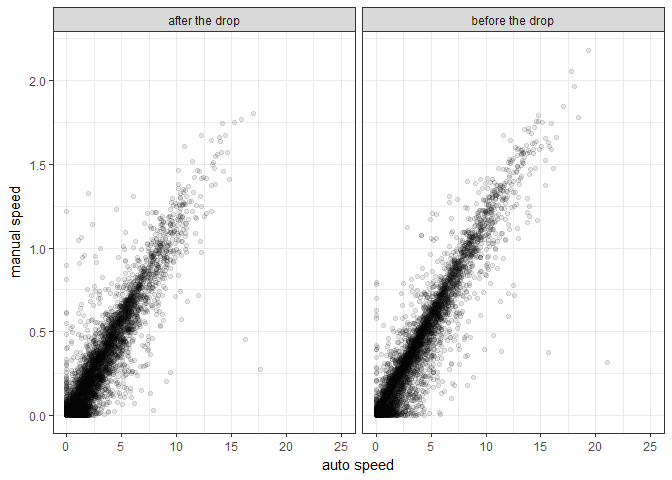

Genotype x genotype interactions in host manipulation - Analyses
================
Dan Benesh

Experiment Background
=====================

Many parasites manipulate the behavior of their hosts in ways that seem beneficial. Little is known about genetic variation in this phenotype. Are parasites genetically variable in how much they manipulate host behavior? Do different host genotypes resist manipulation better than others? I infected 5 host strains with 5 parasite strains to quantify the variability in host manipulation due to parasite genes, host genes, and their interactions. The host-parasite system I used was the tapeworm *Schistocephalus solidus* in its copepod first intermediate host.

OUTLINE Describe treatment differences - pool uninfecteds GxG - absolute vs relative manipulation (abs simpler, relative is relative to controls) Correlated parasite traits? Quant genetics or at least variance partitioning

Exploratory Analyses
====================

Make graph comparing treatments.

The infected copepods are less active than the uninfected copepods. This is true both before and after the simulated attack. When we separate this plot into the different days of the experiment, we see a similar pattern. Maybe at the earliest time point, day 5, the infected copepods are less manipulated.
