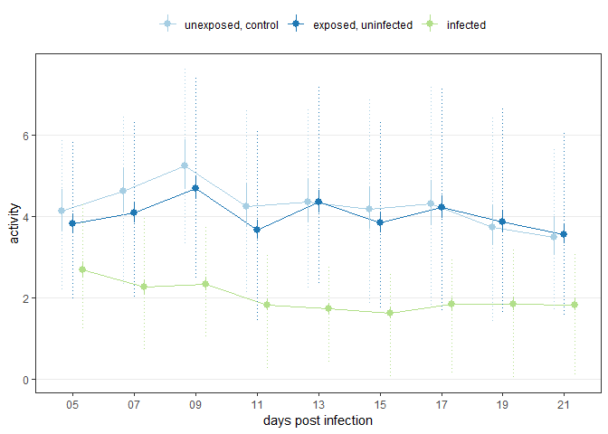
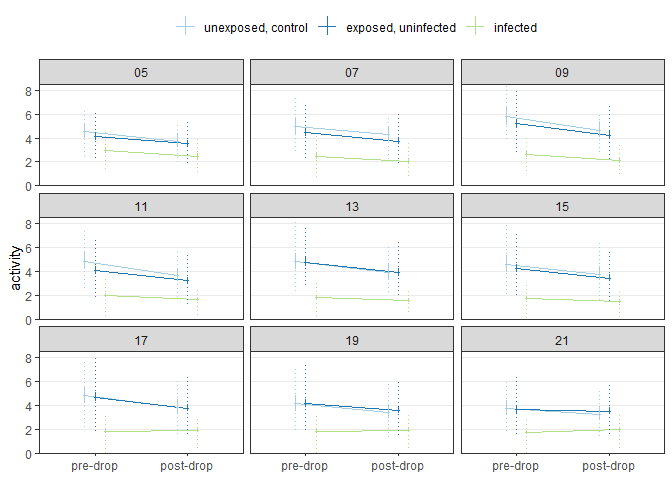
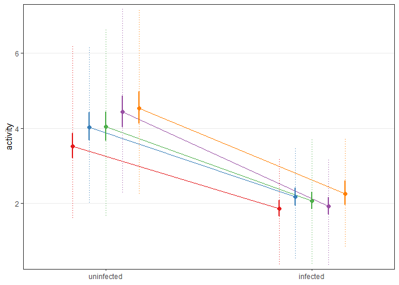
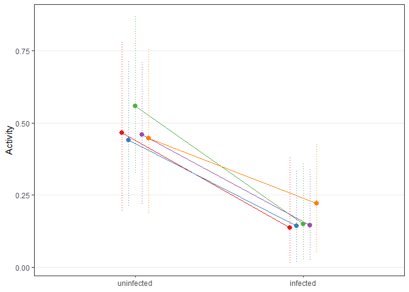
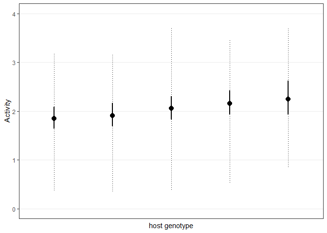
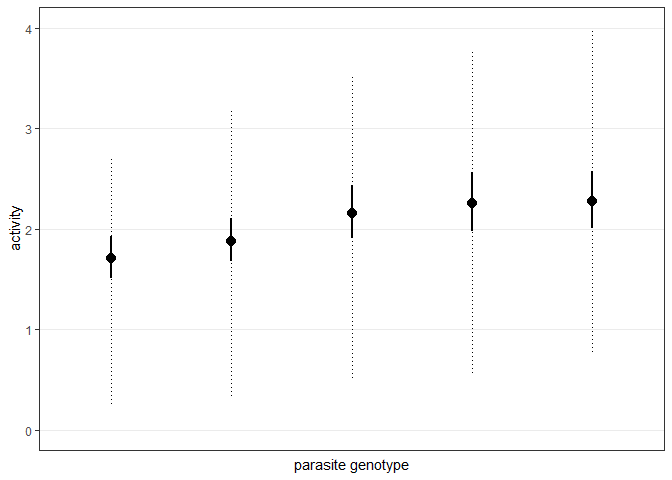
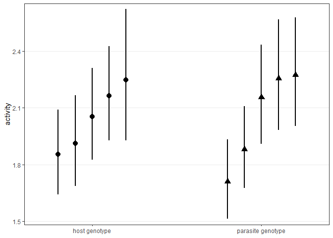
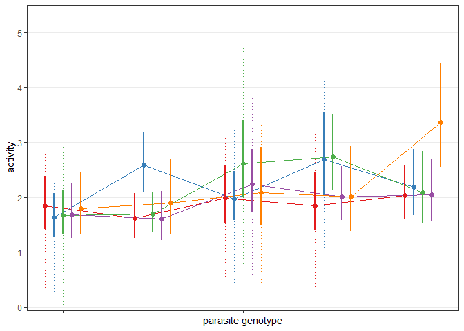
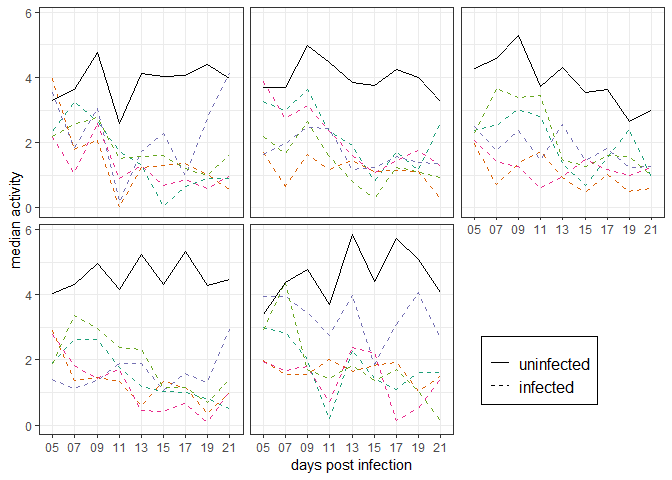

Making figures
================
Dan Benesh

In this document, I aim to make publication quality figures for the
manuscript.

# Fig S1

This is the general difference among treatments. Infecteds are less
active than uninfecteds.

<!-- -->

# Fig S2

Here is how the drop responses differed by treatments and across the
days of the experiment.

<!-- -->

# Fig 1A

How copepod genotype affects copepod behavior, in both infected and
uninfected copepods.

<!-- -->

# Fig 1a - deads excluded

Not run.

# Fig 1a - manual data

In the full auto-tracked data the infection by cop family interaction
was not significant. In the manual data, it was marginally significant.

<!-- -->

# Fig 1B - prelim

In infected copepods, the differences among copepod genotypes.

<!-- -->

# Fig 1B - prelim

In infected copepods, the differences among parasite genotypes.

<!-- -->

# Fig 1B

The differences among copepod and parasite genotypes in the same plot.

<!-- -->

# Fig 1C

Genotype by genotype interactions.

<!-- -->

# Fig 2

The temporal variability of genotype by genotype interactions

<!-- -->
